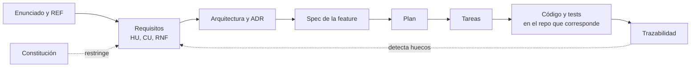

# Documentación del proyecto integrador 2026

Repositorio de documentación del sistema distribuido de turnos. Guarda lo que **cruza repos**: requisitos, arquitectura, contratos entre servicios, decisiones y specs de cada feature. Lo propio de un solo repo (cómo compilar, ejecutar y probar ese repo) vive en el `README` de ese repo.

El desarrollo sigue **Spec-Driven Development (SDD)**: primero se escribe y se acuerda la especificación, y recién después se genera el código a partir de ella, con agentes de IA o a mano. Por eso esta documentación no es un anexo que se escribe al final. Es la **entrada** del trabajo y tiene que coincidir en todo momento con lo implementado (ENUNCIADO §12).

## Repositorios del sistema

| Repo | Contenido |
| --- | --- |
| `app-kmp` | Aplicación Android con Kotlin Multiplatform |
| `catalogo-service` | Servicio de catálogo y sincronización (Java + Spring Boot) |
| `turnos-service` | Servicio de turnos y reservas (Java + Spring Boot) |
| `docs` | Este repo |

## Fuente de verdad

`enunciado/` contiene los documentos de la cátedra **sin modificar**:

- `PROJECT_STATEMENT-v1.md` (en estos docs, **ENUNCIADO**): alcance, requisitos, restricciones y evaluación.
- `INTEGRATION_REFERENCE-v2.md` (**REF**): contratos REST, Redis y Kafka con el servicio de la cátedra. Ante una diferencia con los ejemplos del enunciado, manda la REF (ENUNCIADO §10).

El resto de los documentos **no reescribe el enunciado**: lo cita (`ENUNCIADO §7`, `REF §15.4`) y agrega lo que el enunciado deja a nuestro criterio (cómo lo resolvemos y por qué).

## Mapa de documentos

| Documento | Qué contiene | Preguntas que responde |
| --- | --- | --- |
| [`constitucion.md`](constitucion.md) | Principios no negociables del proyecto | ¿Qué no se puede hacer nunca, lo pida quien lo pida? |
| [`glosario.md`](glosario.md) | Términos del dominio y de la integración | ¿Qué significa exactamente "hold", "proceso", "versión local"? |
| [`requisitos/HU.md`](requisitos/HU.md) | Historias de usuario con criterios de aceptación | ¿Qué tiene que poder hacer cada actor? ¿Cómo sabemos que está hecho? |
| [`requisitos/CU.md`](requisitos/CU.md) | Casos de uso detallados, solo para flujos complejos o sin actor humano | ¿Cuál es el flujo paso a paso, con sus alternativas y errores? |
| [`requisitos/no-funcionales.md`](requisitos/no-funcionales.md) | Requisitos no funcionales: robustez, seguridad, pruebas | ¿Qué tiene que soportar el sistema más allá de funcionar? |
| [`arq/arquitectura.md`](arq/arquitectura.md) | Contexto, contenedores y responsabilidades | ¿Qué piezas hay, qué hace cada una y cómo se conectan? |
| [`arq/seguridad.md`](arq/seguridad.md) | Identidades, JWT, autorización y secretos | ¿Quién puede hacer qué y cómo se verifica? |
| [`arq/modelo-db.md`](arq/modelo-db.md) | Modelo de datos de cada servicio | ¿Qué datos guarda cada servicio y a quién pertenecen? |
| [`arq/maquina-estados.md`](arq/maquina-estados.md) | Máquina de estados local de la reserva | ¿Qué estados hay, qué los hace cambiar y cuáles son finales? |
| [`arq/contratos.md`](arq/contratos.md) | Contratos entre nuestros servicios y hacia la app | ¿Qué operaciones, DTO, autenticación y errores expone cada servicio? |
| [`arq/contratos/*.yaml`](arq/contratos/) | Los mismos contratos en formato OpenAPI | La versión validable del contrato, para implementar y probar |
| [`adr/`](adr/) | Registro de decisiones de arquitectura (ADR) | ¿Qué decidimos, qué alternativas descartamos y por qué? |
| [`specs/`](specs/) | Spec, plan y tareas de cada feature | ¿Qué se implementa ahora, en qué repo y en qué pasos? |
| [`trazabilidad.md`](trazabilidad.md) | Matriz de requisito ↔ spec ↔ test ↔ evidencia | ¿Está cubierto todo lo obligatorio para aprobar? |

## Flujo de trabajo SDD

1. **Entender** una parte del enunciado y discutirla. No se documenta nada que no se haya entendido y acordado.
2. **Requisitos**: se agregan o ajustan las HU, los CU y los RNF que salen de esa parte.
3. **Decisiones**: si hay que elegir entre alternativas (ENUNCIADO §10), se escribe un ADR. Si cambian piezas, contratos o datos, se actualizan los documentos de `arq/`.
4. **Spec de la feature**: se crea `specs/NNN-nombre/` con tres archivos:
   - `spec.md`: **qué** se construye. Referencia las HU, CU y RNF que cubre, e incluye los criterios de aceptación y lo que queda fuera. No habla de clases ni de librerías.
   - `plan.md`: **cómo** se construye. Qué repos toca, qué capas y adaptadores, qué contratos, qué migraciones, qué tests. Respeta la constitución y los ADR.
   - `tasks.md`: lista ordenada de tareas chicas y verificables. Cada tarea deja el sistema en un estado que compila y termina en uno o más commits.
5. **Implementación**: el agente (o una persona) ejecuta las tareas en el repo de código, leyendo la constitución, la spec y el plan.
6. **Trazabilidad**: se completa la fila con los tests y la evidencia. Si la implementación obligó a cambiar algo, **primero se corrige la spec** y después el código.

## Convenciones

### Identificadores

| Tipo | Formato | Ejemplo |
| --- | --- | --- |
| Historia de usuario | `HU-NN` | `HU-01` |
| Caso de uso | `CU-NN` | `CU-03` |
| Requisito no funcional | `RNF-NN` | `RNF-07` |
| ADR | `adr/NNNN-titulo-corto.md` | `adr/0002-emisor-jwt-usuarios.md` |
| Spec de feature | `specs/NNN-nombre/` | `specs/004-sincronizacion-incremental/` |

Los identificadores no se reutilizan. Si algo se descarta, se marca como descartado en lugar de borrarlo, para no romper las referencias.

### Estado de los documentos

Cada HU, CU, RNF y ADR lleva un estado: **Propuesto** (borrador para discutir), **Aceptado** (acordado; se puede implementar) o **Reemplazado** (indica por cuál). Un agente solo implementa sobre elementos **Aceptados**.

### Formato

- Todo en **Markdown** y en español. Los identificadores técnicos (campos, eventos, endpoints) se escriben como en el contrato: en inglés y `camelCase`.
- **Diagramas en Mermaid** dentro del propio `.md` (`flowchart` para arquitectura y despliegue, `sequenceDiagram` para flujos, `stateDiagram-v2` para estados, `erDiagram` para datos). GitHub los renderiza, se versionan como texto y un agente puede leerlos y editarlos.
- **Contratos HTTP en OpenAPI 3** (`arq/contratos/*.yaml`). Los contratos Kafka y REST de la cátedra no se copian: se referencian a la REF.
- Cada afirmación que viene del enunciado lleva su cita (`ENUNCIADO §9`, `REF §14.5`).

### Secretos

Ningún documento contiene el JWT técnico, contraseñas, hosts reales de la cátedra ni valores del objeto `integration`. En los ejemplos se usan marcadores como `<jwt-tecnico>`.

## Cómo usan esta documentación los agentes de IA

Antes de trabajar en cualquier repo, un agente lee, en este orden:

1. `constitucion.md` y `glosario.md`, siempre.
2. La carpeta `specs/NNN-.../` de la feature asignada.
3. Los documentos de `arq/`, los ADR y los requisitos que esa spec referencia.

Si el agente encuentra una contradicción, o una decisión que no está tomada, **se detiene y la plantea** en lugar de resolverla por su cuenta. Las decisiones se toman en conjunto y quedan registradas acá.
