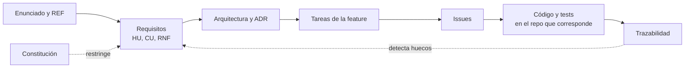

# Documentación del proyecto integrador 2026

Repositorio de documentación del sistema distribuido de turnos. Guarda lo que **cruza repos**: requisitos, arquitectura, contratos entre servicios, decisiones y el plan de tareas de cada feature. Lo propio de un solo repo (cómo compilar, ejecutar y probar ese repo) vive en el `README` de ese repo.

El desarrollo sigue **Spec-Driven Development (SDD)**: primero se escribe y se acuerda la especificación, y recién después se genera el código a partir de ella, con agentes de IA o a mano. Por eso esta documentación no es un anexo que se escribe al final. Es la **entrada** del trabajo y tiene que coincidir en todo momento con lo implementado (ENUNCIADO §12).

## Repositorios del sistema

| Repo | Contenido |
| --- | --- |
| `app-kmp` | Aplicación Android con Kotlin Multiplatform |
| `catalogo-service` | Servicio de catálogo y sincronización (Java + Spring Boot) |
| `turnos-service` | Servicio de turnos y reservas (Java + Spring Boot) |
| `docs` | Este repo |

## Fuente de verdad

`enunciado/` contiene los documentos de la cátedra **sin modificar**:

- `PROJECT_STATEMENT-v1.md` (en estos docs, **ENUNCIADO**): alcance, requisitos, restricciones y evaluación.
- `INTEGRATION_REFERENCE-v2.md` (**REF**): contratos REST, Redis y Kafka con el servicio de la cátedra. Ante una diferencia con los ejemplos del enunciado, manda la REF (ENUNCIADO §10).

El resto de los documentos **no reescribe el enunciado**: lo cita (`ENUNCIADO §7`, `REF §15.4`) y agrega lo que el enunciado deja a nuestro criterio (cómo lo resolvemos y por qué).

## Mapa de documentos

| Documento | Qué contiene | Preguntas que responde |
| --- | --- | --- |
| [`constitucion.md`](constitucion.md) | Principios no negociables del proyecto | ¿Qué no se puede hacer nunca, lo pida quien lo pida? |
| [`glosario.md`](glosario.md) | Términos del dominio y de la integración | ¿Qué significa exactamente "hold", "proceso", "versión local"? |
| [`requisitos/HU.md`](requisitos/HU.md) | Historias de usuario con criterios de aceptación | ¿Qué tiene que poder hacer cada actor? ¿Cómo sabemos que está hecho? |
| [`requisitos/CU.md`](requisitos/CU.md) | Casos de uso detallados, solo para flujos complejos o sin actor humano | ¿Cuál es el flujo paso a paso, con sus alternativas y errores? |
| [`requisitos/no-funcionales.md`](requisitos/no-funcionales.md) | Requisitos no funcionales: robustez, seguridad, pruebas | ¿Qué tiene que soportar el sistema más allá de funcionar? |
| [`arq/arquitectura.md`](arq/arquitectura.md) | Contexto, contenedores y responsabilidades | ¿Qué piezas hay, qué hace cada una y cómo se conectan? |
| [`arq/seguridad.md`](arq/seguridad.md) | Identidades, JWT, autorización y secretos | ¿Quién puede hacer qué y cómo se verifica? |
| [`arq/sincronizacion.md`](arq/sincronizacion.md) | Estrategia de sincronización completa e incremental del catálogo | ¿Qué hace el catálogo en cada situación de versiones, duplicados y fallas? |
| [`arq/modelo-db.md`](arq/modelo-db.md) | Modelo de datos de cada servicio | ¿Qué datos guarda cada servicio y a quién pertenecen? |
| [`arq/maquina-estados.md`](arq/maquina-estados.md) | Máquina de estados local de la reserva | ¿Qué estados hay, qué los hace cambiar y cuáles son finales? |
| [`arq/interfaz.md`](arq/interfaz.md) | Pantallas, navegación y comportamiento de la app | ¿Qué pantallas hay, qué hace cada una y qué muestra ante cada estado o error? |
| [`arq/pruebas.md`](arq/pruebas.md) | Estrategia de pruebas de los backends y de la app | ¿Qué se prueba, en qué nivel y cómo sabemos que alcanza? |
| [`arq/robustez.md`](arq/robustez.md) | Idempotencia y recuperación ante duplicados, pérdidas, desorden, fallas y reinicios | ¿Qué pasa cuando algo se repite, se pierde, llega tarde o se corta? |
| [`arq/despliegue.md`](arq/despliegue.md) | Topología de ejecución con Docker Compose | ¿Qué contenedores se levantan, cómo se conectan y qué configuración reciben? |
| [`arq/contratos.md`](arq/contratos.md) | Contratos entre nuestros servicios y hacia la app | ¿Qué operaciones, DTO, autenticación y errores expone cada servicio? |
| [`arq/contratos/*.yaml`](arq/contratos/) | Los mismos contratos en formato OpenAPI | La versión validable del contrato, para implementar y probar |
| [`adr/`](adr/) | Registro de decisiones de arquitectura (ADR) | ¿Qué decidimos, qué alternativas descartamos y por qué? |
| [`specs/`](specs/) | Tareas de cada feature, enlazadas a sus requisitos | ¿Qué se implementa ahora, en qué repo y en qué pasos? |
| [`trazabilidad.md`](trazabilidad.md) | Matriz de requisito ↔ spec ↔ test ↔ evidencia | ¿Está cubierto todo lo obligatorio para aprobar? |
| [`guia-git.md`](guia-git.md) | Flujo de trabajo con Git: issues, ramas, commits y PR | ¿Cómo se registra y se integra cada cambio? |

## Flujo de trabajo SDD


```mermaid
flowchart LR
    E[Enunciado y REF] --> R[Requisitos<br/>HU, CU, RNF]
    C[Constitución] -.restringe.-> R
    R --> A[Arquitectura y ADR]
    A --> T[Tareas de la feature]
    T --> I[Issues]
    I --> K[Código y tests<br/>en el repo que corresponde]
    K --> M[Trazabilidad]
    M -.detecta huecos.-> R
```

1. **Entender** una parte del enunciado y discutirla. No se documenta nada que no se haya entendido y acordado.
2. **Requisitos**: se agregan o ajustan las HU, los CU y los RNF que salen de esa parte.
3. **Decisiones**: si hay que elegir entre alternativas (ENUNCIADO §10), se escribe un ADR. Si cambian piezas, contratos o datos, se actualizan los documentos de `arq/`.
4. **Tareas de la feature**: se crea `specs/NNN-nombre.md`, un único archivo liviano (ver la plantilla más abajo). **No repite** lo que ya dicen las HU, los CU, los contratos o los ADR: los enlaza. La especificación *es* el conjunto de requisitos y arquitectura; este archivo solo recorta qué parte se construye ahora y en qué pasos.
5. **Issues**: el alumno convierte las tareas en issues de una milestone, desde GitHub, en el repo de código correspondiente. Qué entra en cada milestone se conversa antes ([`guia-git.md`](guia-git.md)).
6. **Implementación**: el agente (o una persona) resuelve la issue leyendo la constitución, el archivo de tareas y lo que este enlaza. El *cómo* lo resuelve el código, que tiene que ser legible por sí mismo.
7. **Trazabilidad**: se completa la fila con los tests y la evidencia. Si la implementación obligó a cambiar algo, **primero se corrige la documentación** (requisito, contrato o ADR) y después el código.

### Plantilla de `specs/NNN-nombre.md`

```markdown
# NNN. Nombre de la feature

- **Estado:** Propuesto | Aceptado | Terminado
- **Repos:** catalogo-service, turnos-service, app-kmp

## Alcance

Qué HU (y qué criterios), CU, RNF, contratos y ADR cubre, enlazados. Qué queda afuera explícitamente.

## Tareas

- [ ] Entregable chico y verificable ("existe X y cumple los criterios Y de HU-NN"). Repo. Issue: #N (la crea el alumno)

## Verificación

Qué tests o pasos demuestran que la feature está terminada.
```

## Qué va y qué no va en estos documentos

Estos documentos son una guía de **producto, requisitos y arquitectura**. Sirven para unificar decisiones, no para escribir el código dos veces.

**Sí van**: qué tiene que hacer el sistema y cómo se verifica; restricciones; piezas y responsabilidades; contratos (OpenAPI, eventos); el modelo de datos y a quién pertenece cada dato; estados y transiciones; decisiones con sus alternativas y su porqué.

**No van**: pseudocódigo, lógica de negocio escrita paso a paso detrás de un contrato, nombres de clases o métodos, ni instrucciones de implementación. Esas decisiones las toma quien implementa, siguiendo la constitución (en los backends, la skill `/hexagonal`; en la app, la skill `/mvvm-kmp`). Dictarlas acá mete ruido y empeora las decisiones técnicas.

## Convenciones

### Identificadores

| Tipo | Formato | Ejemplo |
| --- | --- | --- |
| Historia de usuario | `HU-NN` | `HU-01` |
| Caso de uso | `CU-NN` | `CU-03` |
| Requisito no funcional | `RNF-NN` | `RNF-07` |
| ADR | `adr/NNNN-titulo-corto.md` | `adr/0002-emisor-jwt-usuarios.md` |
| Tareas de una feature | `specs/NNN-nombre.md` | `specs/004-sincronizacion-incremental.md` |

Los identificadores no se reutilizan. Si algo se descarta, se marca como descartado en lugar de borrarlo, para no romper las referencias.

### Estado de los documentos

Cada HU, CU, RNF y ADR lleva un estado: **Propuesto** (borrador para discutir), **Aceptado** (acordado; se puede implementar) o **Reemplazado** (indica por cuál). Un agente solo implementa sobre elementos **Aceptados**.

### Formato

- Todo en **Markdown** y en español. Los identificadores técnicos (campos, eventos, endpoints) se escriben como en el contrato: en inglés y `camelCase`.
- **Diagramas en Mermaid** dentro del propio `.md` (`flowchart` para arquitectura y despliegue, `sequenceDiagram` para flujos, `stateDiagram-v2` para estados, `erDiagram` para datos). GitHub los renderiza, se versionan como texto y un agente puede leerlos y editarlos.
- **Contratos HTTP en OpenAPI 3** (`arq/contratos/*.yaml`). Los contratos Kafka y REST de la cátedra no se copian: se referencian a la REF.
- Cada afirmación que viene del enunciado lleva su cita (`ENUNCIADO §9`, `REF §14.5`).

### Secretos

Ningún documento contiene el JWT técnico, contraseñas, hosts reales de la cátedra ni valores del objeto `integration`. En los ejemplos se usan marcadores como `<jwt-tecnico>`.

### Comentarios de decisión en el código

En los repos de código, cuando una decisión de diseño se materializa en un lugar concreto (por qué algo es un puerto, por qué se eligió un algoritmo, por qué una restricción está en la base), se deja ahí un comentario corto que explica el porqué. Reglas:

- Va **en el lugar donde se tomó la decisión**, no en un documento aparte ni en la cabecera de cada archivo.
- Explica **el porqué**, no lo que el código ya dice. Dos o tres líneas; si necesita más, la decisión merece un ADR y el comentario lo cita.
- Solo para decisiones que alguien podría cuestionar o deshacer sin saber la razón. El código obvio no se comenta.
- En español, como el resto de la documentación.

Estos comentarios no reemplazan a los ADR: el ADR registra las alternativas y el contexto; el comentario evita tener que ir a buscarlo para entender una línea.

## Cómo usan esta documentación los agentes de IA

Antes de trabajar en cualquier repo, un agente lee, en este orden:

1. `constitucion.md` y `glosario.md`, siempre.
2. El archivo `specs/NNN-....md` de la feature asignada.
3. Los requisitos, documentos de `arq/` y ADR que ese archivo enlaza.

Si el agente encuentra una contradicción, o una decisión que no está tomada, **se detiene y la plantea** en lugar de resolverla por su cuenta. Las decisiones se toman en conjunto y quedan registradas acá.
