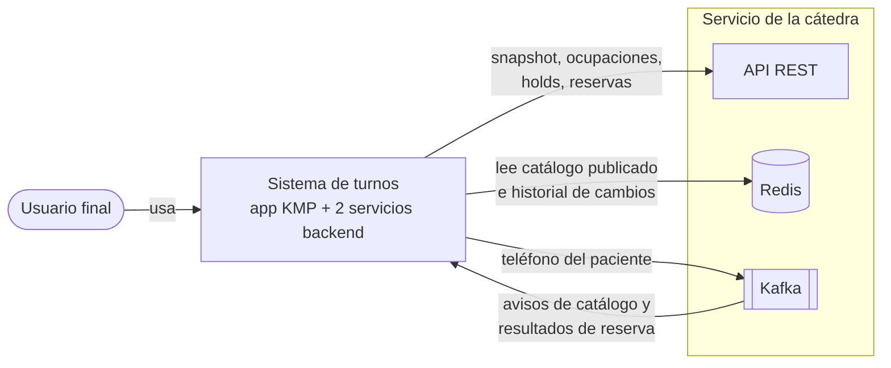
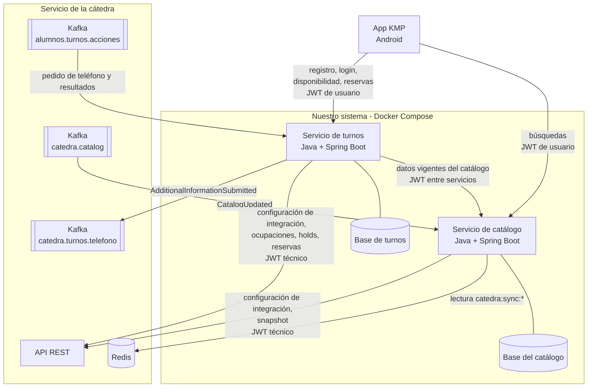

# Arquitectura

Vista general del sistema: qué piezas lo forman, qué responsabilidad tiene cada una y cómo se comunican. El detalle de seguridad, datos, contratos y despliegue está en los demás documentos de `arq/`.

## Contexto

El sistema permite a un usuario final buscar profesionales, ver turnos disponibles, reservarlos, consultarlos y cancelarlos. La cátedra es la fuente autoritativa del catálogo y el registro oficial de las reservas; nuestro sistema se integra con ella por tres canales. *(ENUNCIADO §1)*

| Canal | Para qué se usa | Referencia |
| --- | --- | --- |
| REST | Snapshot del catálogo, ocupaciones, crear y confirmar holds, listar y cancelar reservas | REF §6–§12 |
| Redis | Catálogo publicado, versiones e historial de cambios incrementales (solo lectura) | REF §14 |
| Kafka | Avisos de nueva versión del catálogo y el intercambio asincrónico de la reserva | REF §15 |

## Contenedores

Los topics de Kafka llevan el sufijo `{groupId}` de la cuenta técnica (REF §15.2). Cada backend obtiene al arrancar la configuración de Redis y Kafka desde la API de la cátedra ([ADR-0005](../adr/0005-configuracion-integracion-al-arrancar.md)). Las identidades y la autenticación se detallan en [`seguridad.md`](seguridad.md).

## Responsabilidades

### App KMP

Interfaz del usuario final con el flujo funcional completo: registro, inicio de sesión, búsqueda de profesionales, disponibilidad, reserva (incluida la carga del teléfono), consulta y cancelación de las reservas propias. No habla con la cátedra ni conoce sus credenciales. *(ENUNCIADO §3.2, §5)*

### Servicio de catálogo y sincronización

*(ENUNCIADO §4.1, §6)*

- Guarda la copia local de categorías, profesionales y horarios semanales, y la versión de catálogo aplicada.
- Ejecuta la sincronización completa (snapshot REST) y la incremental (aviso por Kafka, datos desde Redis).
- Detecta discontinuidades y reconstruye la copia local.
- Busca y filtra profesionales solo con datos locales: como mínimo por categoría, nombre, estado habilitado y disponibilidad.
- Informa el estado y los errores de sincronización.
- Es la única fuente local vigente de profesionales y reglas de agenda para el resto del sistema.

### Servicio de turnos y reservas

*(ENUNCIADO §4.2, §7)*

- Registra y autentica a los usuarios finales y emite su JWT ([ADR-0003](../adr/0003-turnos-emite-jwt-usuarios.md)).
- Construye la disponibilidad combinando los horarios vigentes (pedidos al catálogo) con las ocupaciones de la cátedra.
- Inicia y conserva el estado local de los procesos de reserva: crea y confirma holds, participa del intercambio por Kafka y procesa confirmaciones, rechazos, vencimientos y procesos inválidos.
- Asocia cada proceso y cada reserva al usuario final que lo inició, y aplica esa propiedad en toda consulta y cancelación.
- Cancela reservas confirmadas y recupera procesos pendientes o interrumpidos.

## Reglas de comunicación

| Desde | Hacia | Permitido | Decisión |
| --- | --- | --- | --- |
| App KMP | Servicio de catálogo | Sí: búsquedas y datos del catálogo | [ADR-0001](../adr/0001-app-habla-con-ambos-servicios.md) |
| App KMP | Servicio de turnos | Sí: registro, login, disponibilidad, reservas y cancelaciones | [ADR-0001](../adr/0001-app-habla-con-ambos-servicios.md) |
| App KMP | Servicio de la cátedra | **No**: la app nunca ve credenciales de la cátedra | ENUNCIADO §3.2; REF §2 |
| Servicio de turnos | Servicio de catálogo | Sí: datos vigentes antes de operar | [ADR-0002](../adr/0002-comunicacion-unidireccional-turnos-catalogo.md) |
| Servicio de catálogo | Servicio de turnos | **No** | [ADR-0002](../adr/0002-comunicacion-unidireccional-turnos-catalogo.md) |
| Cualquier servicio | Base del otro servicio | **No** | [Constitución P-03](../constitucion.md) |

## Consecuencias de la separación

- Si el servicio de catálogo no está disponible, turnos **no inicia** operaciones que requieran datos vigentes (disponibilidad, nuevas reservas), pero sigue atendiendo lo que depende solo de sus datos, como consultar las reservas propias. *(ENUNCIADO §8)*
- Si el servicio de turnos no está disponible, el catálogo sigue sincronizando y respondiendo búsquedas a usuarios con un JWT vigente, pero no se puede registrar ni iniciar sesión ([ADR-0003](../adr/0003-turnos-emite-jwt-usuarios.md)).
