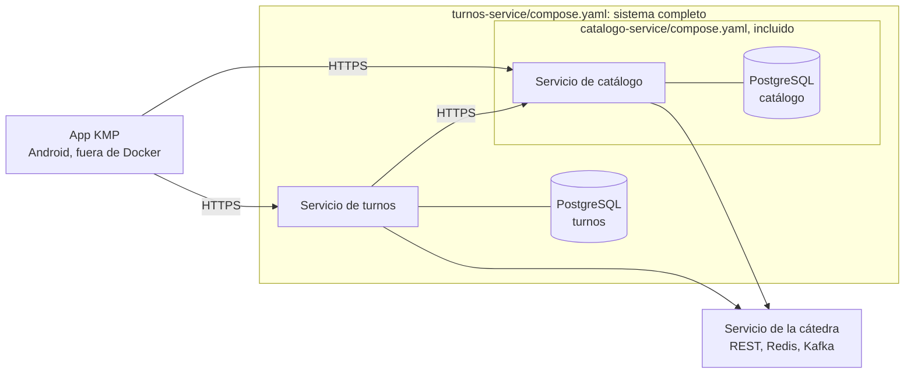

# Despliegue

Topología de ejecución local del sistema.

## Requisitos del enunciado

- Docker Compose levanta los dos servicios backend, sus bases de datos y las dependencias necesarias. *(ENUNCIADO §3)*
- La app Android se ejecuta fuera de los contenedores. *(ENUNCIADO §3)*
- El servicio de la cátedra (REST, Redis y Kafka) es una instancia central; no se levanta localmente. *(REF §3)*
- Los hosts, credenciales y topics de la cátedra se inyectan como configuración externa. *(REF §3; [Constitución P-08](../constitucion.md))*

## Topología



| Contenedor | Definido en | Contenido |
| --- | --- | --- |
| Servicio de catálogo | `catalogo-service/compose.yaml` | El backend de catálogo |
| PostgreSQL del catálogo | `catalogo-service/compose.yaml` | Base, usuario y volumen propios ([ADR-0041](../adr/0041-postgresql-por-servicio.md)) |
| Servicio de turnos | `turnos-service/compose.yaml` | El backend de turnos |
| PostgreSQL de turnos | `turnos-service/compose.yaml` | Base, usuario y volumen propios ([ADR-0041](../adr/0041-postgresql-por-servicio.md)) |

## Formas de levantarlo

([ADR-0042](../adr/0042-ubicacion-docker-compose.md))

- **Un servicio solo:** con el `compose.yaml` de su repo, que levanta el servicio y su base.
- **El sistema completo:** con el `compose.yaml` de `turnos-service`, que incluye el del catálogo. Requiere los repos clonados uno al lado del otro:

```
carpeta-del-proyecto/
├── catalogo-service/
└── turnos-service/
```

El servicio de la cátedra se alcanza por la red que indique la cátedra (en el entorno actual, una red privada virtual a la que se une la máquina que ejecuta los contenedores).

## Configuración

([ADR-0043](../adr/0043-configuracion-externa-env-y-secrets.md))

| Qué | Dónde | En Git |
| --- | --- | --- |
| URL de la cátedra, JWT técnico, credenciales de base, login del administrador | `.env` de cada repo | No; se commitea `.env.example` |
| Par de claves del JWT de usuario, certificado TLS | Carpeta `secrets/`, montada en los contenedores | No |
| Redis, Kafka y topics de la cátedra | Se obtienen de la cátedra al arrancar ([ADR-0005](../adr/0005-configuracion-integracion-al-arrancar.md)) | No |
| Valores operativos ([RNF-09](../requisitos/no-funcionales.md#rnf-09-sin-supuestos-fijos-sobre-los-datos-de-la-cátedra-y-valores-operativos-configurables)) | Configuración de la aplicación, sobrescribible por variables de entorno | Sí, solo los valores iniciales |

Los puertos, nombres de contenedores y variables concretas se documentan en el README y el `.env.example` de cada repo.
