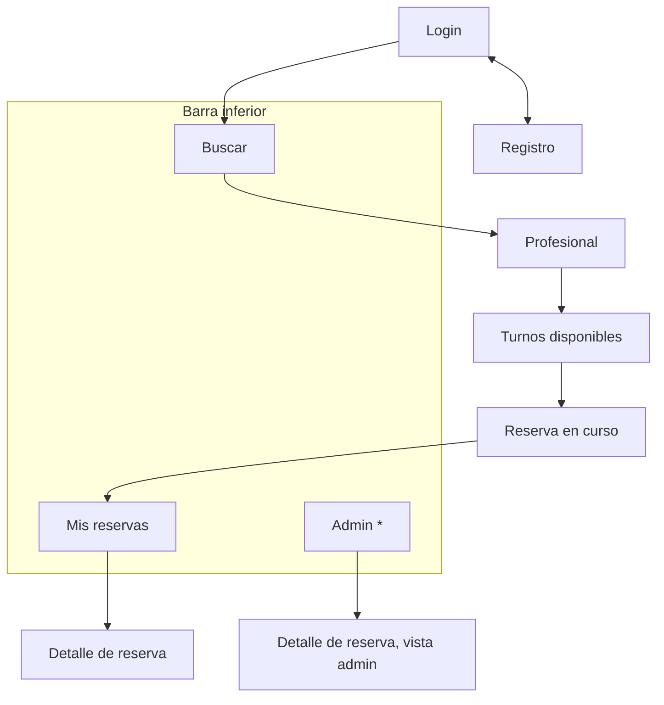

# Organización de la interfaz

Pantallas de la app KMP, cómo se navega entre ellas y qué muestra cada una (ENUNCIADO §3.2, §10). La app implementa el flujo funcional completo del §5 y no habla nunca con la cátedra ([ADR-0001](../adr/0001-app-habla-con-ambos-servicios.md)).

## Navegación

\* Solo visible con `ROLE_ADMIN` ([ADR-0037](../adr/0037-rol-administrador-alcance-cerrado.md)).

Al abrir la app, si hay un JWT vigente se entra directo a Buscar; si no, a Login. Si hay un proceso de reserva activo, la app ofrece volver a Reserva en curso ([ADR-0021](../adr/0021-app-consulta-estado-por-polling.md)).

## Pantallas

| Pantalla | Qué permite | Servicio | Requisito |
| --- | --- | --- | --- |
| **Login** | Iniciar sesión, con la opción de recordar la sesión (`rememberMe`) | Turnos | HU-02 |
| **Registro** | Crear la cuenta con los campos y validaciones de HU-01 | Turnos | HU-01 |
| **Buscar** | Filtrar por categoría, nombre, estado habilitado y disponibilidad (fecha y franja opcional); lista paginada; aviso no bloqueante de "catálogo actualizándose" | Catálogo | HU-04, HU-05 |
| **Profesional** | Ver la agenda vigente del profesional y elegir una fecha (por defecto, la del filtro de búsqueda) | Catálogo | HU-05, ADR-0017 |
| **Turnos disponibles** | Ver los slots libres de la fecha, cambiar de día y tocar "Reservar" | Turnos | HU-06 |
| **Reserva en curso** | Seguir el proceso: estado, mensaje de la cátedra, cuenta regresiva hasta `expiresAt`, campo de teléfono y resultado | Turnos | HU-07 |
| **Mis reservas** | Lista paginada de las reservas propias, con filtro por estado | Turnos | HU-08 |
| **Detalle de reserva** | Ver una reserva propia y cancelarla, con motivo opcional | Turnos | HU-08, HU-09 |
| **Admin** | Lista de todas las reservas con filtros por dueño, estado y fechas | Turnos | HU-10 |
| **Detalle de reserva, vista admin** | Datos de soporte y cancelación con motivo obligatorio | Turnos | HU-10 |

## Reserva en curso

Es la pantalla que muestra la máquina de estados. Mientras el proceso no es final, consulta su estado cada pocos segundos ([ADR-0021](../adr/0021-app-consulta-estado-por-polling.md)) y muestra lo que indica la columna *La app muestra* de [`maquina-estados.md`](maquina-estados.md#estados). En particular:

- En `AWAITING_PHONE` muestra el mensaje de la cátedra, el tiempo restante y el campo de teléfono. Si viene de un rechazo, muestra el motivo.
- El teléfono se valida antes de enviarlo, con la misma regla que el backend ([ADR-0027](../adr/0027-validacion-local-del-telefono.md)).
- En un estado final deja de consultar y muestra el resultado, con acceso a Mis reservas.

## Errores

La app decide qué mostrar por el `status` y el `code` de la respuesta, nunca por el texto ([`contratos.md`](contratos.md)):

| Respuesta | Qué hace la app |
| --- | --- |
| 401 | Descarta el JWT y vuelve a Login |
| 403 | Informa que no tiene permiso |
| 400 con `fieldErrors` | Marca los campos inválidos del formulario |
| 400, 404 o 409 con `code` | Muestra un mensaje propio para cada `code` |
| 503 | Informa que el servicio no está disponible temporalmente y permite reintentar |

## Tecnología y diseño

- **Arquitectura MVVM** según la skill `/mvvm-kmp`: por cada pantalla, un ViewModel con un único estado y acciones; repositorios detrás de interfaces; errores traducidos una sola vez ([ADR-0051](../adr/0051-mvvm-en-la-app.md)). Cada pantalla de la tabla de arriba es una feature de esa skill.
- **Interfaz compartida con Compose Multiplatform**, en el código común de KMP ([ADR-0048](../adr/0048-compose-multiplatform.md)), con el stack de [ADR-0052](../adr/0052-stack-de-la-app.md).
- **Componentes de Material 3**, los que trae Compose, antes que componentes a medida. Se pueden tomar como referencia catálogos de componentes prefabricados.
- **Prototipos con las herramientas de diseño de Claude** antes de implementar las pantallas principales, para acordar la disposición y el flujo ([ADR-0050](../adr/0050-prototipos-con-herramientas-de-diseno.md)). El prototipo sirve de guía visual; la fuente de verdad sigue siendo este documento.
- **El JWT se guarda cifrado** en el dispositivo ([ADR-0049](../adr/0049-jwt-cifrado-en-el-dispositivo.md)).
- **Configuración de la app:** las URL base de los dos servicios y la confianza en el certificado local ([ADR-0035](../adr/0035-https-entre-app-y-backends.md)).
