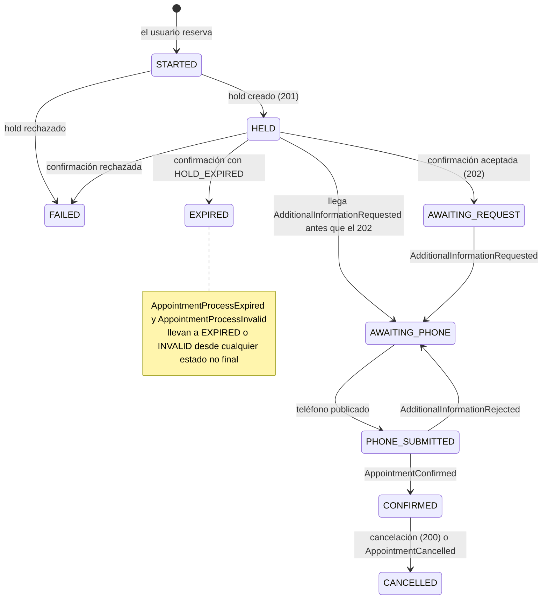

# Máquina de estados del proceso de reserva

Estados locales de un proceso de reserva en el servicio de turnos, qué los hace cambiar y cuáles son finales (ENUNCIADO §7, §10). El flujo completo está en [CU-04](../requisitos/CU.md#cu-04-reservar-un-turno) y las decisiones en [ADR-0023](../adr/0023-estados-solo-avanzan.md).

Cada estado responde a la pregunta *"¿qué estamos esperando?"*. Así la app sabe qué mostrar y la recuperación sabe qué reconciliar.

## Estados

| Estado | Identificador | Qué significa | Final | La app muestra |
| --- | --- | --- | --- | --- |
| Iniciado | `STARTED` | El proceso está guardado; todavía no hay hold | No | "Reservando…" |
| Retenido | `HELD` | La cátedra creó el hold; falta la confirmación inicial | No | "Reservando…" |
| Esperando pedido | `AWAITING_REQUEST` | La cátedra aceptó la confirmación (202); falta el pedido de teléfono | No | "Reservando…" |
| Esperando teléfono | `AWAITING_PHONE` | Llegó el pedido de teléfono (o un rechazo); se espera que el usuario lo ingrese | No | El mensaje de la cátedra, el vencimiento y el campo de teléfono |
| Teléfono enviado | `PHONE_SUBMITTED` | Se publicó el teléfono; se espera el resultado | No | "Confirmando…" |
| Confirmado | `CONFIRMED` | La cátedra confirmó la reserva | Sí, salvo cancelación | La reserva confirmada |
| Cancelado | `CANCELLED` | La reserva confirmada se canceló | Sí | La reserva cancelada |
| Vencido | `EXPIRED` | El hold o el proceso vencieron sin completarse | Sí | "El tiempo para completar la reserva venció" |
| Inválido | `INVALID` | La cátedra detectó una inconsistencia en el proceso | Sí | "No se pudo completar la reserva" |
| Fallido | `FAILED` | La cátedra rechazó el hold o la confirmación | Sí | El motivo (por ejemplo, "el turno ya no está disponible") |

Los identificadores son los que se usan en el código y en los contratos.

## Diagrama

## Transiciones

| Desde | Disparador | Hacia |
| --- | --- | --- |
| — | El usuario inicia una reserva y pasa las validaciones | `STARTED` |
| `STARTED` | La cátedra crea el hold (201) | `HELD` |
| `STARTED` | La cátedra rechaza el hold (`SLOT_ALREADY_HELD`, `SLOT_ALREADY_RESERVED`, `INVALID_SLOT`, `PROFESSIONAL_DISABLED`, `PROFESSIONAL_NOT_FOUND`) | `FAILED` |
| `HELD` | La cátedra acepta la confirmación inicial (202) | `AWAITING_REQUEST` |
| `HELD` | La cátedra responde `HOLD_EXPIRED` | `EXPIRED` |
| `HELD` | La cátedra rechaza la confirmación por otro motivo | `FAILED` |
| `HELD`, `AWAITING_REQUEST` | `AdditionalInformationRequested` | `AWAITING_PHONE` |
| `AWAITING_PHONE` | Se publica `AdditionalInformationSubmitted` | `PHONE_SUBMITTED` |
| `PHONE_SUBMITTED` | `AdditionalInformationRejected` | `AWAITING_PHONE` |
| Cualquier no final | `AppointmentConfirmed` | `CONFIRMED` |
| Cualquier no final | `AppointmentProcessExpired` | `EXPIRED` |
| Cualquier no final | `AppointmentProcessInvalid` | `INVALID` |
| `CONFIRMED` | La cátedra acepta la cancelación (200) o llega `AppointmentCancelled` | `CANCELLED` |
| `STARTED` | Timeout al crear el hold ([ADR-0028](../adr/0028-timeout-al-crear-hold.md)) | `FAILED` |
| `STARTED` | Reconciliación: quedó sin hold registrado | `FAILED` |
| `HELD`, `AWAITING_REQUEST`, `AWAITING_PHONE` | Reconciliación: venció `expiresAt` más el margen | `EXPIRED` |
| `PHONE_SUBMITTED` | Reconciliación: la cátedra informa `CONFIRMED` | `CONFIRMED` |
| `PHONE_SUBMITTED` | Reconciliación: la cátedra informa `FAILED` | `EXPIRED` |
| `CONFIRMED` | Reconciliación: la cátedra informa `CANCELLED` | `CANCELLED` |

## Reglas

1. **Los estados solo avanzan.** Un disparador que no aparece en la tabla para el estado actual no cambia nada: se ignora y queda registrado en el log. Así un evento tardío o repetido nunca retrocede ni reabre un proceso (ENUNCIADO §7; REF §18.3).
2. **Un estado final no se abandona**, salvo `CONFIRMED` → `CANCELLED`.
3. **Los eventos terminales de la cátedra se aplican desde cualquier estado no final.** Si `AppointmentConfirmed` llega mientras el estado local todavía no registró el envío del teléfono, la cátedra es la autoridad y el proceso queda confirmado.
4. **El orden de llegada entre REST y Kafka no importa.** El pedido de teléfono puede llegar antes que la respuesta 202 de la confirmación; por eso el proceso se guarda con su `reservationProcessId` antes de confirmar ([ADR-0022](../adr/0022-proceso-guardado-antes-de-llamar.md)).
5. **Cada evento se procesa una sola vez** por su `eventId` ([ADR-0008](../adr/0008-deduplicacion-por-event-id.md)).
6. **Un rechazo de teléfono no es un estado aparte:** vuelve a `AWAITING_PHONE`, con el motivo y el mensaje del rechazo, hasta `expiresAt` (REF §15.7).
7. **La vigencia real la define la cátedra** (`expiresAt`). Guardar el proceso localmente no extiende el hold (REF §9).

Los timeouts y reintentos de cada operación están en [ADR-0029](../adr/0029-reintentos-acotados-por-operacion.md). Los eventos perdidos y los reinicios con procesos a medias se resuelven con la reconciliación periódica ([CU-05](../requisitos/CU.md#cu-05-reconciliar-procesos-de-reserva), [ADR-0030](../adr/0030-reconciliacion-periodica-de-procesos.md)).
