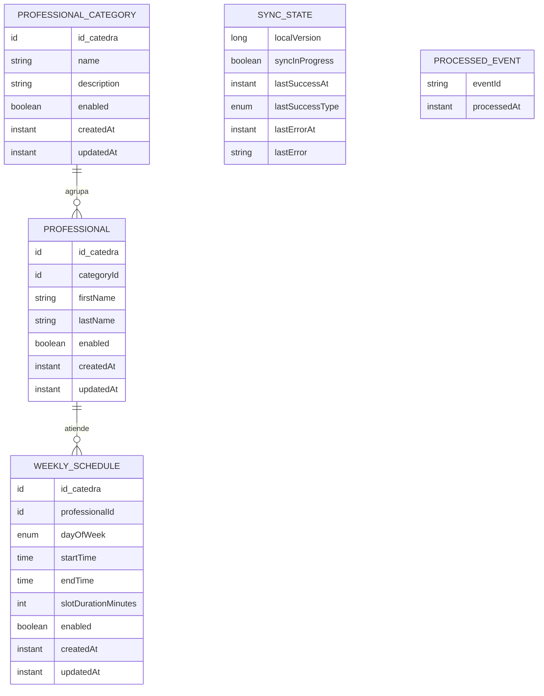
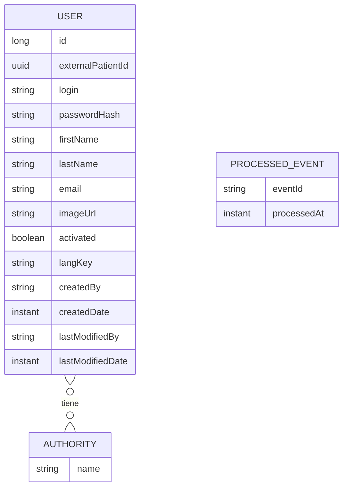

# Modelo de datos

Qué datos guarda cada servicio y a quién pertenecen. Cada servicio es dueño exclusivo de su base y de sus migraciones; ninguno lee ni escribe la base del otro ([Constitución P-03](../constitucion.md)). Motor: PostgreSQL ([ADR-0012](../adr/0012-postgresql.md)).

El modelo es conceptual: entidades, atributos relevantes y relaciones. Los tipos, índices y nombres físicos se definen en las migraciones de cada servicio.

## Servicio de catálogo

| Entidad | Contenido | Origen |
| --- | --- | --- |
| `PROFESSIONAL_CATEGORY`, `PROFESSIONAL`, `WEEKLY_SCHEDULE` | Copia local del catálogo, con los mismos campos que publica la cátedra | REF §7, §14.4 |
| `SYNC_STATE` | Un único registro con la versión local y el estado de sincronización | [`sincronizacion.md`](sincronizacion.md), [ADR-0011](../adr/0011-fallas-y-estado-de-sincronizacion.md) |
| `PROCESSED_EVENT` | `eventId` de los avisos `CatalogUpdated` ya procesados | [ADR-0008](../adr/0008-deduplicacion-por-event-id.md) |

Reglas:

- **La identidad de cada entidad del catálogo es el `id` que asigna la cátedra.** Así, aplicar un cambio o un snapshot es escribir por ese id, y reaplicar da el mismo resultado.
- Las relaciones categoría → profesional → horario se mantienen con integridad referencial ([ADR-0009](../adr/0009-referencias-faltantes-desde-redis.md)).
- Las entidades deshabilitadas se conservan con `enabled = false`; no hay borrado físico (REF §14.4).
- La versión local y los datos que representa se modifican siempre en la misma transacción ([ADR-0007](../adr/0007-concurrencia-optimista-version-local.md), [ADR-0010](../adr/0010-snapshot-en-una-transaccion.md)).

## Servicio de turnos

| Entidad | Contenido | Origen |
| --- | --- | --- |
| `USER`, `AUTHORITY` | Usuarios finales con los datos del usuario de JHipster, más el UUID que se envía como `externalPatientId` | ENUNCIADO §3.2, [ADR-0003](../adr/0003-turnos-emite-jwt-usuarios.md), [ADR-0004](../adr/0004-external-patient-id-uuid.md) |
| `PROCESSED_EVENT` | `eventId` de los eventos del topic de acciones ya procesados | [ADR-0008](../adr/0008-deduplicacion-por-event-id.md) |

Reglas:

- `login`, `email` y `externalPatientId` son únicos.
- La contraseña se guarda solo como hash ([RNF-01](../requisitos/no-funcionales.md#rnf-01-contraseñas-protegidas)).

**Pendiente:** procesos de reserva y reservas, con su asociación al usuario. Se definen con el flujo de reserva y la máquina de estados.

## Lo que ningún servicio guarda

- Turnos **no** guarda categorías, profesionales ni horarios como catálogo vigente ([Constitución P-05](../constitucion.md)).
- El catálogo **no** guarda usuarios ni reservas.
- Ninguno guarda el JWT técnico ni los valores de `integration` en su base ([ADR-0005](../adr/0005-configuracion-integracion-al-arrancar.md)).
