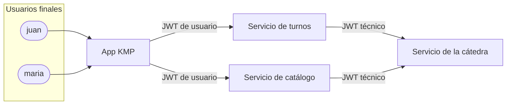

# Seguridad

Identidades, autenticación, autorización y manejo de secretos del sistema. Requisitos base: ENUNCIADO §9 y REF §2, §4 y §5.

## Dos identidades independientes

El sistema maneja dos clases de identidad que no se mezclan nunca (REF §2):

| | Cuenta técnica | Usuario final |
| --- | --- | --- |
| Representa a | El proyecto entero ante la cátedra | Una persona que usa la app |
| Cuántas hay | Una | Una por persona registrada |
| Dónde se registra | En la cátedra, a mano, una sola vez (REF §5.1) | En el servicio de turnos, desde la app ([ADR-0003](../adr/0003-turnos-emite-jwt-usuarios.md)) |
| Quién emite su JWT | La cátedra (vigencia de un año, rol `ROLE_STUDENT_CLIENT`) | El servicio de turnos |
| Quién usa el JWT | Los dos backends, para REST, Redis y Kafka de la cátedra | La app, para llamar a nuestros dos servicios |
| Quién la conoce | La cátedra y nuestros backends | Solo nuestro sistema; la cátedra no sabe que existe |

El JWT técnico y el objeto `integration` nunca salen de los backends: no llegan a la app, a los repositorios, a los logs, a capturas ni a la documentación (REF §2, §5.1; [Constitución P-08](../constitucion.md)).

## Cuenta técnica

- La registra a mano el responsable del proyecto con `POST /api/student/register` (REF §5.1). Si hiciera falta un JWT nuevo, se obtiene con `POST /api/authenticate` y `rememberMe: true` (REF §5.2).
- Los dos backends reciben por configuración externa solo la URL base de la API de la cátedra y el JWT técnico. El resto de la configuración (Redis, Kafka, topics) la obtienen al arrancar con `GET /api/student/integration` ([ADR-0005](../adr/0005-configuracion-integracion-al-arrancar.md)).
- `groupId` identifica la integración técnica, no a un grupo de personas ni a un usuario final (REF §2.1). Siempre sale del JWT técnico: ninguna operación nuestra acepta un `groupId` enviado por un cliente (REF §6).
- Si el JWT o las credenciales quedan expuestos: se crea otra cuenta técnica, se reconfiguran los dos backends y se avisa a la cátedra. No existe la revocación anticipada (REF §5.4).

## Usuario final

- Se registra desde la app contra el servicio de turnos con los datos del usuario de JHipster: `login`, `password`, `firstName`, `lastName`, `email`, `imageUrl` (opcional) y `langKey` (ENUNCIADO §3.2). Las validaciones están en [HU-01](../requisitos/HU.md#hu-01-registro-de-usuario-final).
- El id interno, el UUID usado como `externalPatientId`, el estado de activación, las autoridades y los campos de auditoría los asigna el backend. El cliente no puede elegirlos (ENUNCIADO §3.2).
- Queda activo apenas se registra; no hay verificación por correo (ENUNCIADO §3.2).
- La contraseña se guarda con un hash criptográfico adecuado y nunca aparece en respuestas ni en logs (ENUNCIADO §3.2, §9).
- Al iniciar sesión, el servicio de turnos emite un JWT de usuario que la app usa en todas las llamadas protegidas a los dos servicios (ENUNCIADO §3.2, §9).

## Propiedad de procesos y reservas

La cátedra identifica todo por la cuenta técnica: `GET /api/appointments` devuelve las reservas de **todos** los usuarios del proyecto (REF §11). La propiedad por usuario la aplica nuestro sistema (ENUNCIADO §4.2, §9):

- El servicio de turnos guarda qué usuario inició cada proceso de reserva (identificado por `reservationProcessId`) y cada reserva.
- Toda consulta, confirmación o cancelación se autoriza contra esa asociación local, usando la identidad que viene del JWT de usuario. Nunca se usa un id de usuario enviado por el cliente.
- Lo que devuelva la cátedra se filtra por esa asociación antes de llegar a la app.
- A la cátedra se envía como `externalPatientId` el UUID del usuario ([ADR-0004](../adr/0004-external-patient-id-uuid.md)).

## Pendientes

Se deciden en la parte de seguridad:

- Cómo valida el catálogo el JWT de usuario que emite turnos (clave compartida o par de claves) y la vigencia de ese JWT.
- Cómo se autentica turnos ante el catálogo: propagación del JWT de usuario o un JWT técnico propio, preservando identidad, autorización y trazabilidad (ENUNCIADO §9).
- Protección del canal entre la app y los backends, y CORS (ENUNCIADO §9).
- Rol administrador opcional (ENUNCIADO §9).
