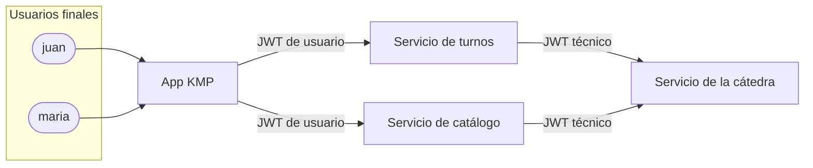

# Seguridad

Identidades, autenticación, autorización y manejo de secretos del sistema. Requisitos base: ENUNCIADO §9 y REF §2, §4 y §5.

## Dos identidades independientes

El sistema maneja dos clases de identidad que no se mezclan nunca (REF §2):

| | Cuenta técnica | Usuario final |
| --- | --- | --- |
| Representa a | El proyecto entero ante la cátedra | Una persona que usa la app |
| Cuántas hay | Una | Una por persona registrada |
| Dónde se registra | En la cátedra, a mano, una sola vez (REF §5.1) | En el servicio de turnos, desde la app ([ADR-0003](../adr/0003-turnos-emite-jwt-usuarios.md)) |
| Quién emite su JWT | La cátedra (vigencia de un año, rol `ROLE_STUDENT_CLIENT`) | El servicio de turnos |
| Quién usa el JWT | Los dos backends, para REST, Redis y Kafka de la cátedra | La app, para llamar a nuestros dos servicios |
| Quién la conoce | La cátedra y nuestros backends | Solo nuestro sistema; la cátedra no sabe que existe |

```mermaid
flowchart LR
    subgraph Usuarios finales
        U1([juan])
        U2([maria])
    end
    APP[App KMP]
    TS[Servicio de turnos]
    CS[Servicio de catálogo]
    CAT[Servicio de la cátedra]

    U1 & U2 --> APP
    APP -->|JWT de usuario| TS
    APP -->|JWT de usuario| CS
    TS -->|JWT técnico| CAT
    CS -->|JWT técnico| CAT
```

El JWT técnico y el objeto `integration` nunca salen de los backends: no llegan a la app, a los repositorios, a los logs, a capturas ni a la documentación (REF §2, §5.1; [Constitución P-08](../constitucion.md)).

## Cuenta técnica

- La registra a mano el responsable del proyecto con `POST /api/student/register` (REF §5.1). Si hiciera falta un JWT nuevo, se obtiene con `POST /api/authenticate` y `rememberMe: true` (REF §5.2).
- Los dos backends reciben por configuración externa solo la URL base de la API de la cátedra y el JWT técnico. El resto de la configuración (Redis, Kafka, topics) la obtienen al arrancar con `GET /api/student/integration` ([ADR-0005](../adr/0005-configuracion-integracion-al-arrancar.md)).
- `groupId` identifica la integración técnica, no a un grupo de personas ni a un usuario final (REF §2.1). Siempre sale del JWT técnico: ninguna operación nuestra acepta un `groupId` enviado por un cliente (REF §6).
- Si el JWT o las credenciales quedan expuestos: se crea otra cuenta técnica, se reconfiguran los dos backends y se avisa a la cátedra. No existe la revocación anticipada (REF §5.4).

## Usuario final

- Se implementa a mano, compatible con el usuario de JHipster y sin usar su generador ([ADR-0018](../adr/0018-usuario-compatible-sin-generador-jhipster.md)).
- Se registra desde la app contra el servicio de turnos con los datos del usuario de JHipster: `login`, `password`, `firstName`, `lastName`, `email`, `imageUrl` (opcional) y `langKey` (ENUNCIADO §3.2). Las validaciones están en [HU-01](../requisitos/HU.md#hu-01-registro-de-usuario-final).
- El id interno, el UUID usado como `externalPatientId`, el estado de activación, las autoridades y los campos de auditoría los asigna el backend. El cliente no puede elegirlos (ENUNCIADO §3.2).
- Queda activo apenas se registra; no hay verificación por correo (ENUNCIADO §3.2).
- La contraseña se guarda con un hash criptográfico adecuado y nunca aparece en respuestas ni en logs (ENUNCIADO §3.2, §9).
- Al iniciar sesión, el servicio de turnos emite un JWT de usuario que la app usa en todas las llamadas protegidas a los dos servicios (ENUNCIADO §3.2, §9).

## Propiedad de procesos y reservas

La cátedra identifica todo por la cuenta técnica: `GET /api/appointments` devuelve las reservas de **todos** los usuarios del proyecto (REF §11). La propiedad por usuario la aplica nuestro sistema (ENUNCIADO §4.2, §9):

- El servicio de turnos guarda qué usuario inició cada proceso de reserva (identificado por `reservationProcessId`) y cada reserva.
- Toda consulta, confirmación o cancelación se autoriza contra esa asociación local, usando la identidad que viene del JWT de usuario. Nunca se usa un id de usuario enviado por el cliente.
- Lo que devuelva la cátedra se filtra por esa asociación antes de llegar a la app.
- A la cátedra se envía como `externalPatientId` el UUID del usuario ([ADR-0004](../adr/0004-external-patient-id-uuid.md)).

## JWT de usuario

- **Firma:** par de claves RSA. Turnos firma con la clave privada; el catálogo valida con la clave pública y no puede emitir tokens ([ADR-0032](../adr/0032-jwt-firmado-con-par-de-claves.md)).
- **Vigencia:** 24 horas, o 30 días con `rememberMe`, configurables y sin refresh tokens ([ADR-0033](../adr/0033-vigencia-jwt-usuario.md)).
- **Validación:** los dos servicios verifican firma, vigencia y rol en cada pedido protegido ([RNF-04](../requisitos/no-funcionales.md#rnf-04-endpoints-protegidos-por-defecto)).
- **Rol:** `ROLE_USER`, asignado al registrarse.

## Comunicación entre servicios

Turnos llama al catálogo reenviando el mismo JWT de usuario que recibió de la app. El catálogo lo valida igual que cuando llama la app. Así se preserva la identidad del usuario y la trazabilidad de punta a punta ([ADR-0034](../adr/0034-propagacion-jwt-usuario-entre-servicios.md)).

## Canal y CORS

- La app y los backends se comunican por HTTPS; en el entorno local, con un certificado autofirmado en el que confía la app ([ADR-0035](../adr/0035-https-entre-app-y-backends.md)).
- CORS está cerrado: ningún origen web permitido, con una lista configurable vacía ([ADR-0036](../adr/0036-cors-cerrado.md)).

## Limitaciones conocidas

- No hay revocación anticipada de JWT de usuario: un token vale hasta su vencimiento.
- No hay límite de intentos de inicio de sesión.

## Pendientes

- Rol administrador opcional (ENUNCIADO §9): en discusión.
