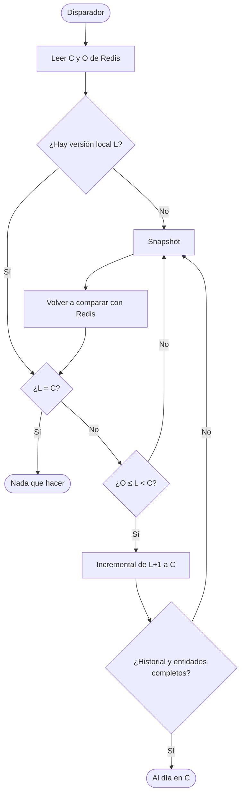

# Sincronización del catálogo

Estrategia con la que el servicio de catálogo mantiene su copia local igual al catálogo publicado por la cátedra, aun después de estar apagado, perder avisos o reiniciarse a mitad de una actualización. Cubre la sincronización completa (ENUNCIADO §6.1) y la incremental (ENUNCIADO §6.2). El flujo paso a paso está en [CU-01 y CU-02](../requisitos/CU.md).

## Versiones

El catálogo de la cátedra avanza por **versiones**: un número entero que solo crece y que aumenta con cada publicación. El servicio de catálogo guarda una **versión local**, que indica exactamente qué versión reflejan sus datos. Sincronizar es cerrar la diferencia entre la versión local y la publicada.

La versión local solo cambia cuando los datos que representa quedaron guardados por completo (ENUNCIADO §6.1, §6.2; REF §7, §14.5).

## Fuentes

| Fuente | Qué aporta | Referencia |
| --- | --- | --- |
| Kafka `catedra.catalog.{groupId}` | `CatalogUpdated`: **solo un aviso** de que hay una versión nueva. No trae datos | REF §15.3 |
| Redis `catedra:sync:current-version` | Última versión publicada (C) | REF §14.2 |
| Redis `catedra:sync:oldest-available-version` | Versión más vieja desde la que se puede avanzar de forma incremental (O) | REF §14.2 |
| Redis `catedra:sync:metadata` | Las mismas versiones y la fecha de publicación, en un hash | REF §14.3 |
| Redis `catedra:sync:changes:{v}` | **IDs** de las entidades que cambiaron en la versión `v`, por colección | REF §14.5 |
| Redis `catedra:sync:professional-categories`, `professionals`, `weekly-schedules` | **Estado actual** de cada entidad (field = ID, value = JSON) | REF §14.4 |
| REST `GET /api/synchronization/snapshot` | Catálogo completo con su `snapshotVersion` | REF §7 |

Detalles que condicionan la estrategia:

- **Los hashes guardan el estado actual, no el de cada versión.** Al aplicar la versión 5 con la cátedra en la 7, cada entidad se lee como está en la 7. No es un error: siempre se escribe el estado vigente, el resultado converge al de la última versión y reaplicar es inofensivo.
- **No hay borrados físicos.** Una entidad dada de baja sigue en su hash con `enabled: false` y se guarda así en la copia local. El snapshot también incluye las deshabilitadas (REF §7, §14.4).

## Modos

### Completa (snapshot)

Se pide el snapshot por REST y se **reemplaza la copia local entera**, junto con la versión local (`snapshotVersion`), en una sola unidad: o se aplican las tres colecciones y la versión, o no se aplica nada (REF §7; [ADR-0010](../adr/0010-snapshot-en-una-transaccion.md)).

Al terminar se vuelve a comparar con Redis: mientras se aplicaba el snapshot pudo haberse publicado una versión más nueva, que se aplica por la vía incremental.

### Incremental

Se aplican las versiones **en orden, de a una**, desde la siguiente a la local hasta la actual. Para cada versión se leen los IDs afectados en `changes:{v}` y el estado actual de esas entidades en los hashes. La versión local avanza a `v` en la misma unidad en que se guardan sus cambios: **todo o nada por versión**. Si el servicio se cae a mitad de una versión, la versión local sigue en la anterior y esa versión se vuelve a aplicar entera (ENUNCIADO §6.2; REF §14.5).

Si una entidad referencia a otra que la copia local todavía no tiene (por ejemplo, un profesional que ahora apunta a una categoría creada en una versión posterior), también se trae el estado actual de la referenciada desde su hash. Si tampoco está en Redis, el estado no se puede verificar y corresponde un snapshot ([ADR-0009](../adr/0009-referencias-faltantes-desde-redis.md)).

## Qué hacer en cada situación

En cada ciclo de sincronización se leen C y O de Redis y se comparan con la versión local L:

| Situación | Acción | Motivo |
| --- | --- | --- |
| No hay versión local (base vacía) | Snapshot | Inicialización (ENUNCIADO §6.1) |
| L = C | Nada | Ya está al día |
| O ≤ L < C | Incremental de L+1 a C | Historial continuo disponible (REF §16) |
| L < O | Snapshot | Falta historial que conecta la versión local (REF §14.2, §18.2) |
| L > C | Snapshot | Estado local que no se puede verificar (ENUNCIADO §6.2) |
| Falta `changes:{v}` para alguna versión del rango | Snapshot | Discontinuidad (ENUNCIADO §6.2) |
| Un ID de `changes:{v}` o una entidad referenciada no está en su hash | Snapshot | Estado que no se puede verificar (ENUNCIADO §6.2) |

> Con L = 3, O = 4 y C = 7 **no** se aplica desde `changes:4`: como L < O, corresponde un snapshot (REF §18.2).

## Disparadores

Un ciclo de sincronización se inicia por cualquiera de estos motivos ([ADR-0006](../adr/0006-disparadores-sincronizacion.md)):

| Disparador | Cubre |
| --- | --- |
| Aviso `CatalogUpdated` por Kafka | La actualización normal, apenas se publica una versión |
| Arranque del servicio | Base vacía y todo lo publicado mientras el servicio estuvo apagado |
| Chequeo periódico (intervalo configurable) | Avisos perdidos: si no llega otro aviso, el servicio igual se pone al día (ENUNCIADO §8) |

El número que trae `CatalogUpdated` no se usa para decidir: siempre se compara con lo que informa Redis. Por eso un aviso perdido se recupera con el próximo disparador, sea cual sea.

## Duplicados y concurrencia

- **Avisos duplicados.** La entrega de Kafka es al menos una vez (REF §15.1). Cada `eventId` procesado se registra y un duplicado se reconoce y se ignora. Aunque no se registrara, reprocesar sería inofensivo, porque L ya sería igual a C ([ADR-0008](../adr/0008-deduplicacion-por-event-id.md)).
- **Offset de Kafka.** Se confirma después de persistir el resultado del aviso (REF §16).
- **Sincronizaciones simultáneas.** Si dos disparadores coinciden, una versión solo se aplica si la versión local sigue siendo la anterior en el momento de guardar. La que llega segunda no aplica nada ([ADR-0007](../adr/0007-concurrencia-optimista-version-local.md)).

## Fallas

Si Redis, la API REST o la base no responden durante un ciclo:

- La versión local queda en la última versión aplicada por completo; nunca queda una versión a medias.
- Se registra el error en el estado de sincronización y en los logs.
- No hay reintentos en loop. El aviso de Kafka se confirma igual y el próximo disparador vuelve a intentar (ENUNCIADO §8; [ADR-0011](../adr/0011-fallas-y-estado-de-sincronizacion.md)).
- Las búsquedas siguen respondiendo con la copia local vigente.

## Búsquedas durante una sincronización

Las búsquedas nunca ven una copia a medias: ven la copia anterior completa hasta que la sincronización termina y después la nueva completa ([ADR-0010](../adr/0010-snapshot-en-una-transaccion.md)).

Mientras hay una sincronización en curso, la app muestra un aviso no bloqueante de "catálogo actualizándose", para que el usuario sepa que un cambio reciente todavía puede no verse. Puede seguir buscando sobre la copia vigente ([HU-04](../requisitos/HU.md#hu-04-catálogo-actualizado)).

## Estado de sincronización

El servicio informa su estado de sincronización (ENUNCIADO §4.1; [ADR-0011](../adr/0011-fallas-y-estado-de-sincronizacion.md)):

- versión local;
- si hay una sincronización en curso;
- fecha y tipo (snapshot o incremental) de la última sincronización exitosa;
- último error, si lo hubo, y cuándo ocurrió.

Se expone a usuarios autenticados y se usa tanto para el aviso de la app como para mostrar las transiciones de versión en la demo. El namespace privado de Redis (`alumnos:{groupId}:*`) no se usa para esto: es opcional y duplicaría lo que ya está en la base (REF §14.6).

## Cómo se demuestra (ENUNCIADO §11)

| Evidencia | Escenario |
| --- | --- |
| Inicialización desde snapshot | Arrancar con la base vacía; el estado pasa de "sin versión" a `snapshotVersion` |
| Actualización incremental | Con el servicio al día, la cátedra publica una versión; la versión local avanza y el cambio se ve en las búsquedas |
| Recuperación tras una discontinuidad | Detener el servicio hasta que la versión local quede por debajo de O; al arrancar, el servicio detecta L < O y aplica un snapshot |
| Mensaje duplicado | Reprocesar un `CatalogUpdated` ya procesado; se ignora y la copia no cambia |
