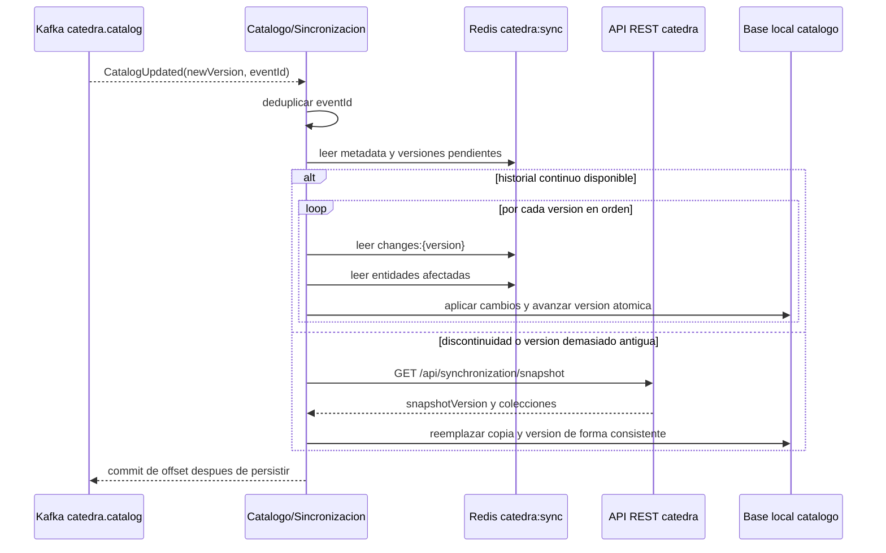
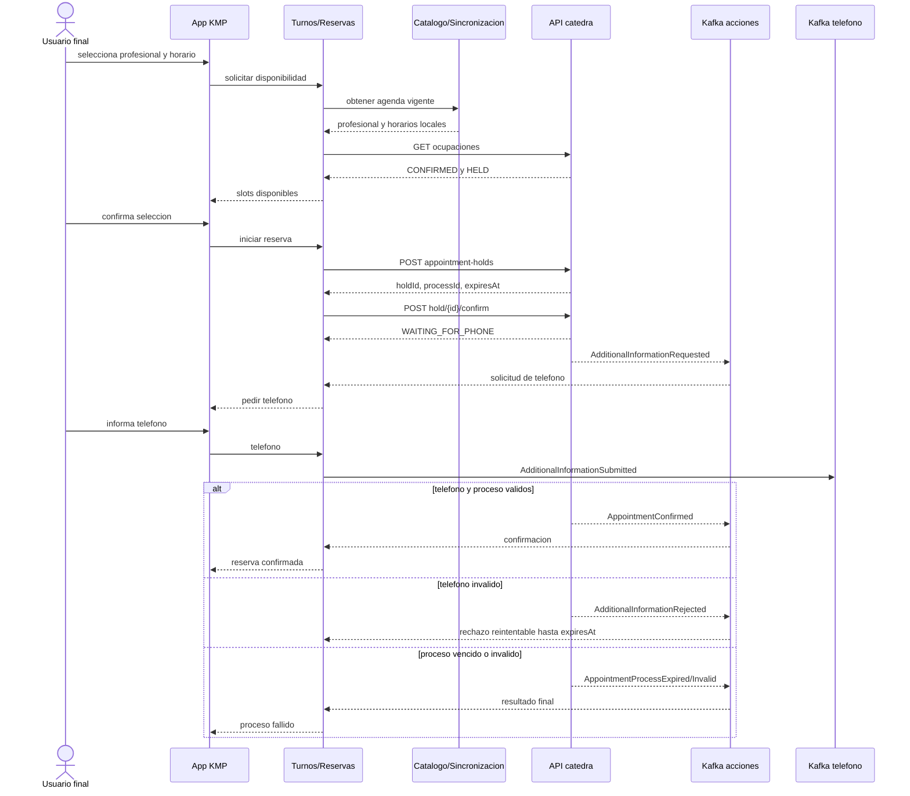

# Referencia de integracion con el servicio de catedra

> Contrato v1 para revision docente. Los datos definitivos de acceso al entorno se enviaran por otro canal.

## 1. Proposito

Este documento contiene los contratos que cada alumno necesita para integrar sus dos servicios backend con el servicio central de la catedra. Describe autenticacion, REST, Redis, Kafka, errores y comportamientos de recuperacion.

Los ejemplos muestran datos ficticios. Los nombres, IDs, instantes, credenciales y direcciones reales dependeran del entorno y de la cuenta tecnica de cada proyecto.

## 2. Identidades

La solucion utiliza dos clases de identidad que no deben confundirse:

- **Cuenta tecnica del proyecto:** el alumno la crea manualmente con Postman contra el servicio de catedra. Sus credenciales y JWT son utilizados por los dos backends del proyecto para acceder a REST, Redis y Kafka de la catedra.
- **Usuario final:** se registra desde la aplicacion KMP contra los backends desarrollados por el alumno. Busca profesionales, inicia reservas y administra solamente sus propias reservas.

Los JWT son independientes. El JWT tecnico de catedra nunca debe enviarse a KMP.

El servicio central conoce la cuenta tecnica del proyecto, pero no conoce las cuentas finales creadas en la aplicacion. El backend de turnos debera asociar localmente sus procesos y reservas con el usuario final correspondiente. Para `externalPatientId` debera enviar un identificador estable del usuario dentro de la aplicacion.

### 2.1. Significado de `groupId`

`groupId` es el nombre historico del campo contractual que identifica una integracion tecnica ante la catedra. En este proyecto individual, cada alumno obtiene un unico `groupId` para su cuenta tecnica.

No representa un grupo de trabajo ni un usuario final. Se utiliza para aislar el acceso REST, las credenciales y namespaces Redis, los topics y consumer group Kafka y las reservas registradas en la catedra. El nombre del campo se conserva para mantener la compatibilidad del contrato v1.

## 3. Acceso a la infraestructura

Los alumnos consumiran una instancia central administrada por la catedra. No ejecutaran una copia local del servicio central.

Antes de habilitar el entorno, la catedra enviara por otro canal:

- URL base de la API REST;
- host y puerto de Redis;
- bootstrap servers de Kafka.

Todos estos valores deben externalizarse. No deben fijarse en el codigo fuente ni publicarse en el repositorio.

## 4. Convenciones generales

- Los endpoints protegidos usan `Authorization: Bearer <jwt-tecnico>`.
- El JWT tecnico emitido durante el registro tiene una vigencia de un año.
- Los dos servicios backend del alumno usan la misma cuenta tecnica y el mismo JWT de catedra.
- Las fechas usan `yyyy-MM-dd`.
- Los instantes usan ISO-8601 en UTC, por ejemplo `2026-09-10T14:30:00Z`.
- Las horas son locales de atencion. Los clientes deben aceptar `HH:mm` y `HH:mm:ss`.
- Los JSON usan nombres de propiedades en `camelCase`.
- Los errores REST usan `application/problem+json` y un `code` funcional estable.
- Los consumidores Kafka deben ignorar campos adicionales desconocidos compatibles con v1.
- La entrega Kafka es al menos una vez; pueden existir mensajes duplicados.

## 5. Alta y configuracion de la cuenta tecnica

### 5.1. Registro inicial

Cada alumno creara una cuenta tecnica para su proyecto una unica vez con Postman o una herramienta HTTP equivalente.

```http
POST /api/student/register
Content-Type: application/json
```

No requiere autenticacion.

#### Request

| Campo | Tipo | Obligatorio | Restricciones |
| --- | --- | --- | --- |
| `login` | string | si | 3 a 50 caracteres; letras, numeros y caracteres admitidos por el login JHipster |
| `password` | string | si | 4 a 100 caracteres |
| `groupId` | string | si | 3 a 100 caracteres antes de normalizar |
| `firstName` | string | no | maximo 50 |
| `lastName` | string | no | maximo 50 |
| `email` | string | no | email valido, 5 a 254 caracteres, unico si se informa |
| `langKey` | string | no | 2 a 10 caracteres; por defecto `es` |

Ejemplo:

```json
{
  "login": "juan.perez",
  "password": "una-clave-segura",
  "groupId": "Proyecto Juan Perez",
  "firstName": "Juan",
  "lastName": "Perez",
  "email": "juan.perez@example.com",
  "langKey": "es"
}
```

`groupId` se normaliza a minusculas ASCII. Las secuencias no alfanumericas se reemplazan por `-` y se quitan guiones iniciales o finales. Por ejemplo, `Proyecto Juan Pérez` se convierte en `proyecto-juan-perez`. El resultado debe tener al menos tres caracteres.

#### Response

`201 Created`:

```json
{
  "id_token": "<jwt-tecnico-de-un-ano>",
  "integration": {
    "groupId": "proyecto-juan-perez",
    "redisHost": "redis.catedra.internal",
    "redisPort": 6379,
    "redisUsername": "grp_proyecto-juan-perez",
    "redisPassword": "<secreto-redis>",
    "redisReadNamespace": "catedra:sync:*",
    "redisWriteNamespace": "alumnos:proyecto-juan-perez:*",
    "kafkaBootstrapServers": "kafka.catedra.internal:9092",
    "kafkaConsumerGroupId": "alumnos-proyecto-juan-perez",
    "kafkaCatalogTopic": "catedra.catalog.proyecto-juan-perez",
    "kafkaAppointmentActionsTopic": "alumnos.turnos.acciones.proyecto-juan-perez",
    "kafkaAppointmentPhoneTopic": "catedra.turnos.telefono.proyecto-juan-perez",
    "provisioningStatus": "PROVISIONED"
  }
}
```

`provisioningStatus` puede ser `PENDING`, `PROVISIONED`, `FAILED` o `REVOKED`. `redisPassword` solo se entrega cuando el estado es `PROVISIONED`.

El alumno debe guardar de forma segura el JWT y la configuracion. El JWT no debe aparecer en repositorios, capturas, documentacion, logs ni en la aplicacion Android.

### 5.2. Login tecnico

Permite obtener otro JWT y recuperar la configuracion vigente.

```http
POST /api/authenticate
Content-Type: application/json
```

Request:

```json
{
  "username": "juan.perez",
  "password": "una-clave-segura",
  "rememberMe": true
}
```

Restricciones: `username` tiene entre 1 y 254 caracteres; `password`, entre 4 y 100. Para obtener la vigencia larga se debe enviar `rememberMe: true`.

Response `200 OK`: misma estructura `id_token` e `integration` del registro. La cabecera `Authorization` tambien contiene el bearer token.

Credenciales incorrectas responden `401 Unauthorized`.

### 5.3. Recuperar la integracion actual

```http
GET /api/student/integration
Authorization: Bearer <jwt-tecnico>
```

Response `200 OK`: objeto `integration` sin envoltorio:

```json
{
  "groupId": "proyecto-juan-perez",
  "redisHost": "redis.catedra.internal",
  "redisPort": 6379,
  "redisUsername": "grp_proyecto-juan-perez",
  "redisPassword": "<secreto-redis>",
  "redisReadNamespace": "catedra:sync:*",
  "redisWriteNamespace": "alumnos:proyecto-juan-perez:*",
  "kafkaBootstrapServers": "kafka.catedra.internal:9092",
  "kafkaConsumerGroupId": "alumnos-proyecto-juan-perez",
  "kafkaCatalogTopic": "catedra.catalog.proyecto-juan-perez",
  "kafkaAppointmentActionsTopic": "alumnos.turnos.acciones.proyecto-juan-perez",
  "kafkaAppointmentPhoneTopic": "catedra.turnos.telefono.proyecto-juan-perez",
  "provisioningStatus": "PROVISIONED"
}
```

### 5.4. Credencial expuesta

Si el JWT o las credenciales se pierden o exponen, el alumno debe crear otra cuenta tecnica, configurar los dos backends con los nuevos valores e informar a la catedra. La revocacion anticipada de JWT no forma parte del alcance.

## 6. Mapa REST

| Metodo | Ruta | Resultado exitoso |
| --- | --- | --- |
| `POST` | `/api/student/register` | `201`, crea cuenta y devuelve JWT/configuracion |
| `POST` | `/api/authenticate` | `200`, devuelve JWT/configuracion |
| `GET` | `/api/student/integration` | `200`, devuelve configuracion vigente |
| `GET` | `/api/synchronization/snapshot` | `200`, snapshot completo |
| `GET` | `/api/appointment-occupancies` | `200`, slots no disponibles |
| `POST` | `/api/appointment-holds` | `201`, crea hold |
| `POST` | `/api/appointment-holds/{holdId}/confirm` | `202`, inicia paso Kafka |
| `GET` | `/api/appointments` | `200`, lista paginada |
| `POST` | `/api/appointments/{reservationProcessId}/cancel` | `200`, cancela reserva |

Salvo registro y login, todos requieren JWT tecnico con `ROLE_STUDENT_CLIENT`. La integracion tecnica siempre se obtiene del JWT; ninguna operacion acepta `groupId` para elegir otra integracion.

## 7. Snapshot de catalogo

```http
GET /api/synchronization/snapshot
Authorization: Bearer <jwt-tecnico>
```

Devuelve entidades habilitadas y deshabilitadas. No incluye historial incremental.

Response `200 OK`:

```json
{
  "snapshotVersion": 7,
  "generatedAt": "2026-09-10T13:44:59Z",
  "professionalCategories": [
    {
      "id": 1,
      "name": "Clinica medica",
      "description": "Atencion clinica general",
      "enabled": true,
      "createdAt": "2026-07-01T12:00:00Z",
      "updatedAt": "2026-09-10T13:40:00Z"
    }
  ],
  "professionals": [
    {
      "id": 15,
      "categoryId": 1,
      "firstName": "Ana",
      "lastName": "Gomez",
      "enabled": true,
      "createdAt": "2026-07-01T12:00:00Z",
      "updatedAt": "2026-09-10T13:40:00Z"
    }
  ],
  "weeklySchedules": [
    {
      "id": 21,
      "professionalId": 15,
      "dayOfWeek": "MONDAY",
      "startTime": "09:00:00",
      "endTime": "12:00:00",
      "slotDurationMinutes": 30,
      "enabled": true,
      "createdAt": "2026-07-01T12:00:00Z",
      "updatedAt": "2026-09-10T13:40:00Z"
    }
  ]
}
```

`dayOfWeek` admite `MONDAY`, `TUESDAY`, `WEDNESDAY`, `THURSDAY`, `FRIDAY`, `SATURDAY` y `SUNDAY`.

La copia local debe actualizarse de forma consistente. `snapshotVersion` solo se guarda como version local cuando las tres colecciones quedaron aplicadas correctamente.

## 8. Ocupaciones

Devuelve posiciones no disponibles, combinando reservas confirmadas y holds activos.

```http
GET /api/appointment-occupancies?professionalId=15&from=2026-09-14&to=2026-09-14
Authorization: Bearer <jwt-tecnico>
```

Parametros obligatorios:

| Parametro | Tipo | Descripcion |
| --- | --- | --- |
| `professionalId` | integer int64 | ID del profesional |
| `from` | date | inicio inclusivo |
| `to` | date | fin inclusivo; no puede ser anterior a `from` |

Response `200 OK`:

```json
{
  "professionalId": 15,
  "from": "2026-09-14",
  "to": "2026-09-14",
  "occupancies": [
    {
      "date": "2026-09-14",
      "startTime": "09:00:00",
      "status": "CONFIRMED",
      "expiresAt": null
    },
    {
      "date": "2026-09-14",
      "startTime": "09:30:00",
      "status": "HELD",
      "expiresAt": "2026-09-10T14:44:50Z"
    }
  ]
}
```

`status` es `CONFIRMED` o `HELD`. `expiresAt` solo tiene valor para `HELD`. Si un slot aparece en ambos origenes, prevalece `CONFIRMED`. Una lista vacia es una respuesta valida.

## 9. Crear un hold

```http
POST /api/appointment-holds
Authorization: Bearer <jwt-tecnico>
Content-Type: application/json
```

Request:

```json
{
  "professionalId": 15,
  "date": "2026-09-14",
  "startTime": "09:30",
  "externalPatientId": "user-42"
}
```

Todos los campos son obligatorios. `externalPatientId` no puede estar en blanco y admite hasta 100 caracteres. La fecha, hora y profesional deben identificar un slot habilitado de la agenda.

Response `201 Created`:

```json
{
  "holdId": "hold-6c0c2f41",
  "reservationProcessId": "process-a92b47d0",
  "status": "HELD",
  "expiresAt": "2026-09-10T14:44:50Z"
}
```

El hold es temporal. La vigencia real se determina por `expiresAt`; una copia local no extiende el TTL.

## 10. Confirmar inicialmente un hold

```http
POST /api/appointment-holds/{holdId}/confirm
Authorization: Bearer <jwt-tecnico>
Content-Type: application/json
```

Request:

```json
{
  "externalPatientId": "user-42",
  "patientFirstName": "Juan",
  "patientLastName": "Perez"
}
```

| Campo | Obligatorio | Restricciones |
| --- | --- | --- |
| `externalPatientId` | si | no blanco, maximo 100, debe coincidir con el hold |
| `patientFirstName` | si | no blanco, 2 a 100 |
| `patientLastName` | si | no blanco, 2 a 100 |

Response `202 Accepted`:

```json
{
  "reservationProcessId": "process-a92b47d0",
  "status": "WAITING_FOR_PHONE",
  "expiresAt": "2026-09-10T14:44:50Z"
}
```

La catedra crea una reserva `PHONE_PENDING` y publica `AdditionalInformationRequested`. El proceso debe completarse antes de `expiresAt`.

## 11. Listar reservas de la integracion tecnica

```http
GET /api/appointments?status=CONFIRMED&from=2026-09-01&to=2026-09-30&externalPatientId=user-42&page=0&size=20
Authorization: Bearer <jwt-tecnico>
```

Filtros opcionales y combinables:

- `status`: `PHONE_PENDING`, `CONFIRMED`, `CANCELLED` o `FAILED`;
- `from`: fecha minima inclusiva;
- `to`: fecha maxima inclusiva;
- `externalPatientId`: coincidencia exacta;
- `page`, `size`, `sort`: paginacion Spring/JHipster.

El orden predeterminado es fecha de turno descendente y hora descendente. La respuesta incluye `X-Total-Count` y `Link`.

Response `200 OK`:

```json
[
  {
    "reservationId": 8251,
    "reservationProcessId": "process-a92b47d0",
    "externalPatientId": "user-42",
    "appointmentDate": "2026-09-14",
    "startTime": "09:30:00",
    "endTime": "10:00:00",
    "professionalId": 15,
    "professionalFirstName": "Ana",
    "professionalLastName": "Gomez",
    "patientFirstName": "Juan",
    "patientLastName": "Perez",
    "patientPhone": "+5492615551234",
    "status": "CONFIRMED",
    "createdAt": "2026-09-10T14:35:00Z",
    "confirmedAt": "2026-09-10T14:36:00Z",
    "cancelledAt": null,
    "cancellationReason": null
  }
]
```

La API devuelve las reservas de toda la cuenta tecnica del proyecto. El backend del alumno debe aplicar su propia asociacion con el usuario final y no exponer reservas ajenas en KMP.

## 12. Cancelar una reserva

```http
POST /api/appointments/{reservationProcessId}/cancel
Authorization: Bearer <jwt-tecnico>
Content-Type: application/json
```

El body es opcional. `reason` admite hasta 500 caracteres.

```json
{
  "reason": "Cambio solicitado por el usuario"
}
```

Response `200 OK`:

```json
{
  "reservationId": 8251,
  "reservationProcessId": "process-a92b47d0",
  "status": "CANCELLED",
  "cancelledAt": "2026-09-11T15:10:00Z"
}
```

La cancelacion de una reserva ya `CANCELLED` es idempotente y devuelve su estado actual. La operacion publica `AppointmentCancelled`.

## 13. Errores REST

Los clientes deben decidir por `status` y `code`, nunca por el texto de `detail`.

```http
Content-Type: application/problem+json
```

Ejemplo:

```json
{
  "type": "https://www.jhipster.tech/problem/problem-with-message",
  "title": "Conflict",
  "status": 409,
  "detail": "Slot already held",
  "message": "error.http.409",
  "path": "/api/appointment-holds",
  "code": "SLOT_ALREADY_HELD"
}
```

Para errores de body se agrega `fieldErrors`:

```json
{
  "type": "https://www.jhipster.tech/problem/constraint-violation",
  "title": "Method argument not valid",
  "status": 400,
  "message": "error.validation",
  "path": "/api/appointment-holds",
  "code": "VALIDATION_ERROR",
  "fieldErrors": [
    {
      "objectName": "appointmentHoldRequestDTO",
      "field": "professionalId",
      "message": "must not be null"
    }
  ]
}
```

Los rechazos `401` y `403` producidos directamente por Spring Security pueden no incluir `code`.

### 13.1. Matriz completa

| Operacion | HTTP | `code` | Condicion |
| --- | --- | --- | --- |
| cualquier body validado | 400 | `VALIDATION_ERROR` | falta un campo, formato o longitud invalida |
| registro | 400 | `USERNAME_ALREADY_EXISTS` | `login` ya utilizado |
| registro | 400 | `EMAIL_ALREADY_EXISTS` | email ya utilizado |
| registro | 400 | `STUDENT_GROUP_ALREADY_EXISTS` | `groupId` normalizado ya utilizado |
| registro | 400 | `INVALID_GROUP_ID` | normalizacion produce menos de 3 caracteres |
| registro | 400 | `INVALID_PASSWORD` | password fuera de 4 a 100 caracteres |
| integracion actual | 404 | `STUDENT_INTEGRATION_NOT_FOUND` | usuario sin integracion |
| listado, holds o cancelacion | 403 | `STUDENT_INTEGRATION_NOT_FOUND` | JWT sin integracion tecnica asociada |
| ocupaciones o listado | 400 | `INVALID_DATE_RANGE` | `from` posterior a `to` |
| crear o confirmar hold | 404 | `PROFESSIONAL_NOT_FOUND` | profesional inexistente |
| crear hold | 400 | `PROFESSIONAL_DISABLED` | profesional deshabilitado |
| crear o confirmar hold | 400 | `INVALID_SLOT` | slot fuera de agenda habilitada |
| crear o confirmar hold | 409 | `SLOT_ALREADY_RESERVED` | slot confirmado por otra reserva |
| crear hold | 409 | `SLOT_ALREADY_HELD` | hold activo para el mismo slot |
| confirmar hold | 404 | `HOLD_NOT_FOUND` | hold inexistente o no recuperable |
| confirmar hold | 404 | `HOLD_EXPIRED` | hold vencido |
| confirmar hold | 403 | `HOLD_OWNER_MISMATCH` | hold de otro `groupId` tecnico |
| confirmar hold | 400 | `EXTERNAL_PATIENT_MISMATCH` | paciente distinto al guardado en el hold |
| confirmar hold | 409 | `RESERVATION_PROCESS_ALREADY_CONFIRMED` | proceso ya confirmado inicialmente |
| cancelar | 404 | `RESERVATION_NOT_FOUND` | proceso inexistente |
| cancelar | 403 | `RESERVATION_OWNER_MISMATCH` | reserva de otro `groupId` tecnico |
| cancelar | 409 | `RESERVATION_NOT_CANCELLABLE` | estado distinto de `CONFIRMED` o `CANCELLED` |
| infraestructura | 503 | sin garantia de `code` | dependencia requerida no disponible |
| servidor | 500 | sin garantia de `code` | error interno no esperado |

## 14. Redis

### 14.1. Conexion y permisos

Se usan `redisHost`, `redisPort`, `redisUsername` y `redisPassword` entregados en `integration`.

La ACL permite:

- lectura en `catedra:sync:*`;
- lectura y escritura en el namespace individual `alumnos:{groupId}:*`;
- comandos de lectura y escritura no peligrosos;
- ningun acceso contractual a `catedra:holds:*`.

Los holds son internos de la catedra y se manipulan exclusivamente por REST.

### 14.2. Versiones

| Clave | Tipo | Permiso | TTL | Ejemplo |
| --- | --- | --- | --- | --- |
| `catedra:sync:current-version` | String decimal | lectura | sin TTL | `7` |
| `catedra:sync:oldest-available-version` | String decimal | lectura | sin TTL | `4` |

Si la version local es menor que `oldest-available-version`, no estan disponibles todos los incrementos necesarios y se debe obtener un snapshot REST.

### 14.3. Metadata

`catedra:sync:metadata` es un Hash de strings, de solo lectura y sin TTL.

```text
currentVersion = 7
oldestAvailableVersion = 4
publishedAt = 2026-09-10T13:44:59Z
```

### 14.4. Entidades actuales

Son Hashes de solo lectura y sin TTL. El field es el ID decimal y el value es JSON.

#### `catedra:sync:professional-categories`

Field `1`:

```json
{
  "id": 1,
  "name": "Clinica medica",
  "description": "Atencion clinica general",
  "enabled": true,
  "createdAt": "2026-07-01T12:00:00Z",
  "updatedAt": "2026-09-10T13:40:00Z"
}
```

#### `catedra:sync:professionals`

Field `15`:

```json
{
  "id": 15,
  "categoryId": 1,
  "firstName": "Ana",
  "lastName": "Gomez",
  "enabled": true,
  "createdAt": "2026-07-01T12:00:00Z",
  "updatedAt": "2026-09-10T13:40:00Z"
}
```

#### `catedra:sync:weekly-schedules`

Field `21`:

```json
{
  "id": 21,
  "professionalId": 15,
  "dayOfWeek": "MONDAY",
  "startTime": "09:00:00",
  "endTime": "12:00:00",
  "slotDurationMinutes": 30,
  "enabled": true,
  "createdAt": "2026-07-01T12:00:00Z",
  "updatedAt": "2026-09-10T13:40:00Z"
}
```

Las entidades deshabilitadas permanecen en los Hashes y representan bajas logicas.

### 14.5. Cambios incrementales

`catedra:sync:changes:{version}` es un String cuyo contenido es JSON. No posee TTL individual contractual; su disponibilidad depende de la ventana de versiones retenida.

Ejemplo `catedra:sync:changes:7`:

```json
{
  "version": 7,
  "changes": {
    "professionalCategories": [],
    "professionals": [15],
    "weeklySchedules": []
  }
}
```

Los arrays contienen IDs afectados, no las entidades completas. Para aplicar la version se debe leer el estado vigente de cada ID desde el Hash correspondiente. Una version local solo avanza despues de aplicar correctamente todos sus cambios.

### 14.6. Namespace privado

`alumnos:{groupId}:*` permite lectura y escritura al titular de la integracion tecnica. Puede utilizarse para estado auxiliar propio, por ejemplo:

```text
alumnos:proyecto-juan-perez:diagnostics:last-sync
```

La estructura y el TTL de esas claves son decisiones del alumno. Este namespace no es fuente autoritativa del catalogo ni de las reservas y no reemplaza la persistencia propia de los servicios.

## 15. Kafka

### 15.1. Convenciones

- `schemaVersion` vale `1`.
- Dentro de v1 no se eliminan campos ni se cambia su tipo o significado.
- Pueden agregarse campos opcionales; los consumidores deben ignorar campos desconocidos.
- La entrega es al menos una vez.
- `eventId` es la clave de idempotencia funcional.
- La message key de eventos de turnos es `reservationProcessId`.
- La message key de `CatalogUpdated` es `newVersion` como texto.
- Los eventos de un mismo proceso comparten message key para conservar orden dentro de una particion.

### 15.2. Topics

| Topic | Direccion | Eventos |
| --- | --- | --- |
| `catedra.catalog.{groupId}` | catedra a alumno | `CatalogUpdated` |
| `alumnos.turnos.acciones.{groupId}` | catedra a alumno | solicitudes y resultados de reserva |
| `catedra.turnos.telefono.{groupId}` | alumno a catedra | `AdditionalInformationSubmitted` |

Los nombres concretos y el consumer group sugerido se reciben en `integration`.

### 15.3. `CatalogUpdated`

Topic: `catedra.catalog.{groupId}`. Message key: version como texto, por ejemplo `7`.

```json
{
  "eventId": "catalog-event-7-4f3b",
  "eventType": "CatalogUpdated",
  "newVersion": 7,
  "occurredAt": "2026-09-10T13:44:59Z",
  "source": "MANUAL",
  "schemaVersion": 1
}
```

`source` identifica el origen de la version, por ejemplo `MANUAL` o `SCHEDULED`. El evento notifica; los datos se obtienen desde Redis o mediante snapshot.

### 15.4. `AdditionalInformationRequested`

Topic: `alumnos.turnos.acciones.{groupId}`. Message key: `reservationProcessId`.

```json
{
  "eventId": "request-event-8a31",
  "eventType": "AdditionalInformationRequested",
  "reservationProcessId": "process-a92b47d0",
  "holdId": "hold-6c0c2f41",
  "requiredField": "PHONE_NUMBER",
  "message": "Ingrese un numero de telefono para continuar.",
  "expiresAt": "2026-09-10T14:44:50Z",
  "occurredAt": "2026-09-10T14:35:10Z",
  "schemaVersion": 1
}
```

Debe conservarse `eventId` para enviarlo como `requestEventId` en la respuesta.

### 15.5. `AdditionalInformationSubmitted`

Topic: `catedra.turnos.telefono.{groupId}`. Direccion: alumno a catedra. Message key: `reservationProcessId`.

```json
{
  "eventId": "phone-submitted-b91e",
  "eventType": "AdditionalInformationSubmitted",
  "groupId": "proyecto-juan-perez",
  "reservationProcessId": "process-a92b47d0",
  "holdId": "hold-6c0c2f41",
  "requestEventId": "request-event-8a31",
  "information": {
    "phoneNumber": "+5492615551234"
  },
  "occurredAt": "2026-09-10T14:36:00Z",
  "schemaVersion": 1
}
```

Todos los campos son obligatorios. `eventType` y `schemaVersion` deben tener exactamente los valores mostrados. La message key debe coincidir con `reservationProcessId`.

Antes de validar, la catedra elimina espacios, guiones, parentesis y puntos. El resultado debe cumplir `^\+?[0-9]{7,15}$`.

### 15.6. `AppointmentConfirmed`

Topic: `alumnos.turnos.acciones.{groupId}`. Message key: `reservationProcessId`.

```json
{
  "eventId": "confirmation-event-7d10",
  "eventType": "AppointmentConfirmed",
  "groupId": "proyecto-juan-perez",
  "reservationProcessId": "process-a92b47d0",
  "holdId": "hold-6c0c2f41",
  "requestEventId": "request-event-8a31",
  "reservationId": 8251,
  "professionalId": 15,
  "date": "2026-09-14",
  "startTime": "09:30",
  "status": "CONFIRMED",
  "occurredAt": "2026-09-10T14:36:01Z",
  "schemaVersion": 1
}
```

### 15.7. `AdditionalInformationRejected`

Topic: `alumnos.turnos.acciones.{groupId}`. Message key: `reservationProcessId`.

```json
{
  "eventId": "rejection-event-7d11",
  "eventType": "AdditionalInformationRejected",
  "groupId": "proyecto-juan-perez",
  "reservationProcessId": "process-a92b47d0",
  "holdId": "hold-6c0c2f41",
  "requestEventId": "request-event-8a31",
  "reason": "INVALID_PHONE_NUMBER",
  "message": "El telefono ingresado no es valido.",
  "expiresAt": "2026-09-10T14:44:50Z",
  "occurredAt": "2026-09-10T14:36:01Z",
  "schemaVersion": 1
}
```

El proceso continua disponible hasta `expiresAt`; puede enviarse otro evento valido con un `eventId` nuevo.

### 15.8. `AppointmentProcessExpired`

Topic: `alumnos.turnos.acciones.{groupId}`. Message key: `reservationProcessId`.

```json
{
  "eventId": "process-event-7d12",
  "eventType": "AppointmentProcessExpired",
  "groupId": "proyecto-juan-perez",
  "reservationProcessId": "process-a92b47d0",
  "holdId": "hold-6c0c2f41",
  "requestEventId": "request-event-8a31",
  "reason": "HOLD_EXPIRED",
  "occurredAt": "2026-09-10T14:44:52Z",
  "schemaVersion": 1
}
```

### 15.9. `AppointmentProcessInvalid`

Topic: `alumnos.turnos.acciones.{groupId}`. Message key: `reservationProcessId`.

```json
{
  "eventId": "process-event-7d13",
  "eventType": "AppointmentProcessInvalid",
  "groupId": "proyecto-juan-perez",
  "reservationProcessId": "process-a92b47d0",
  "holdId": "hold-6c0c2f41",
  "requestEventId": "request-event-8a31",
  "reason": "REQUEST_EVENT_MISMATCH",
  "occurredAt": "2026-09-10T14:36:01Z",
  "schemaVersion": 1
}
```

`reason` describe la inconsistencia detectada. El cliente debe tratar el proceso como invalido y reconciliarlo mediante REST si necesita confirmar el estado persistido.

### 15.10. `AppointmentCancelled`

Topic: `alumnos.turnos.acciones.{groupId}`. Message key: `reservationProcessId`.

```json
{
  "eventId": "cancellation-event-7d14",
  "eventType": "AppointmentCancelled",
  "groupId": "proyecto-juan-perez",
  "reservationProcessId": "process-a92b47d0",
  "holdId": "hold-6c0c2f41",
  "requestEventId": "request-event-8a31",
  "reservationId": 8251,
  "professionalId": 15,
  "date": "2026-09-14",
  "startTime": "09:30",
  "status": "CANCELLED",
  "reason": "Cambio solicitado por el usuario",
  "occurredAt": "2026-09-11T15:10:00Z",
  "schemaVersion": 1
}
```

`reason` puede ser `null`.

## 16. Diagrama de sincronizacion



Kafka es una notificacion, no la fuente del catalogo. Si una notificacion se pierde, la comparacion de versiones debe permitir detectar y recuperar el atraso.

## 17. Diagrama de reserva



## 18. Recuperacion

### 18.1. Mensaje Kafka duplicado

Entrada: se recibe por segunda vez el mismo `eventId`.

Resultado esperado: el consumidor reconoce que ya fue procesado, no repite efectos funcionales y puede confirmar el offset. El estado final permanece igual.

### 18.2. Version incremental perdida

Estado local: version `3`. Redis informa `currentVersion=7` y `oldestAvailableVersion=4`.

Resultado esperado: no se intenta comenzar en `changes:4`, porque falta la version que conecta el estado local. Se solicita el snapshot, se reemplaza la copia de forma consistente y se guarda su `snapshotVersion`.

### 18.3. Hold o proceso vencido

Entrada: REST responde `HOLD_EXPIRED` o Kafka entrega `AppointmentProcessExpired`.

Resultado esperado: el backend cierra el proceso local, evita nuevos intentos de confirmacion y muestra el vencimiento al usuario. Un evento tardio no puede reabrir un estado final.

### 18.4. Reintentos

Un timeout no prueba que una operacion haya fallado. Antes de repetir una accion con efectos, el backend debe consultar o reconciliar el estado mediante los identificadores persistidos. Los reintentos deben ser limitados y observables.

## 19. Limite del contrato

La catedra proporciona los contratos externos y los comportamientos esperados. Cada alumno sigue siendo responsable de definir:

- endpoints y DTO entre sus propios servicios;
- persistencia y transacciones locales;
- estrategia concreta de deduplicacion;
- almacenamiento seguro de secretos;
- timeouts, backoff y limites de reintentos;
- maquina de estados local;
- observabilidad y diagnostico.

No se proporciona codigo de productores, consumidores ni clientes REST/Redis.
