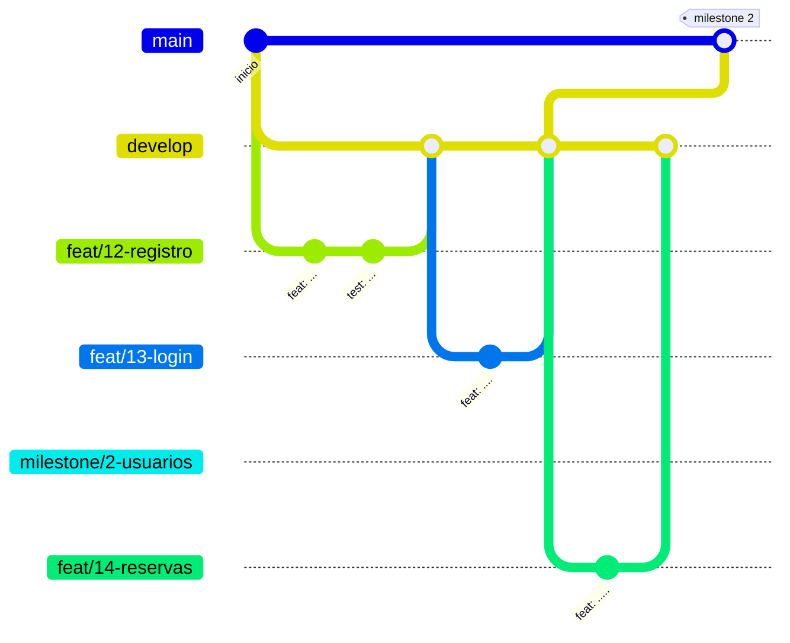

# Flujo de trabajo con Git

Cómo se trabaja en los tres repositorios de código (`app-kmp`, `catalogo-service` y `turnos-service`). El objetivo es que el historial muestre la evolución del trabajo y permita seguir cada cambio desde el requisito hasta el código (ENUNCIADO §13.1; [Constitución P-12](constitucion.md)).

## Quién hace qué

- **Las milestones y las issues las crea el alumno, desde la interfaz de GitHub.** Ningún agente las crea, las cierra ni las modifica por su cuenta.
- **Qué entra en cada milestone se conversa antes** entre el alumno y el agente: por dónde encarar el trabajo y cómo partirlo en issues.
- El agente trabaja sobre una issue que ya existe. Crea la rama de esa issue, vinculada a ella y a partir de `develop` actualizada, escribe los archivos y propone los mensajes de commit.
- **Los commits, el push, el pull request y el merge los hace el alumno**, después de revisar los cambios. El agente no commitea ni mergea en los repos de código.

## Ramas



| Rama | Para qué | Vida |
| --- | --- | --- |
| `main` | Lo entregable: el estado al cierre de cada milestone. Protegida | Permanente |
| `develop` | Integración: acá se junta el trabajo de las issues | Permanente |
| Rama de feature | El trabajo de **una** issue | Se borra al mergear a `develop` |
| Rama de milestone | El estado de `develop` al cerrar **una** milestone, fijo. Es lo que se le presenta al profesor | Hasta que su PR se mergea a `main` |

## Reglas

1. **Toda unidad de trabajo tiene una issue**, dentro de una milestone.
2. **Una rama por issue**, creada desde `develop` actualizada.
3. **Cada rama se mergea a `develop` por pull request** y después se borra.
4. **Al completar una milestone se crea su rama de milestone y esa rama se mergea a `main` por pull request**, con la revisión del profesor. Nadie commitea directo a `main` ni abre un PR de `develop` a `main`.
5. **El merge conserva los commits** (merge commit, sin squash), para que el historial muestre cómo se construyó cada cambio.
6. **Las pruebas corren en CI en cada pull request** ([ADR-0046](adr/0046-ci-con-github-actions.md)). En los PR hacia `develop` el resultado no bloquea el merge: las pruebas ya se corrieron en la máquina antes de commitear, y si el CI falla se corrige en la issue siguiente. En el PR hacia `main` se espera a que el CI pase antes de mergear.

GitHub solo cierra una issue automáticamente (`Closes #N`) cuando el cambio llega a la rama por defecto, que es `main`. Como las ramas de feature se mergean a `develop`, la issue se cierra a mano al mergear su PR, o queda cerrada sola cuando la milestone llega a `main`.

### Rama de milestone

Un pull request no guarda una copia de la rama de origen: la sigue. Todo lo que se mergea a esa rama después de abrir el PR pasa a formar parte del PR. Por eso el PR hacia `main` no sale de `develop`: mientras el profesor revisa una milestone, `develop` sigue recibiendo el trabajo de la siguiente, y el PR terminaría mezclando las dos.

- Al cerrar la última issue de una milestone, se crea la rama `milestone/<número>-<nombre>` en el commit de `develop` donde termina esa milestone (el merge de su último PR).
- El PR hacia `main` sale de esa rama y lleva al profesor como revisor. `main` exige una aprobación para mergear.
- La rama de milestone no recibe trabajo nuevo. `develop` sigue avanzando sin afectar al PR.
- Si la revisión pide cambios, se corrigen en una rama que sale de la rama de milestone, se mergean a ella por PR y después se llevan también a `develop`.
- Al mergear el PR a `main`, la rama de milestone se borra.

**Excepción: el repo `docs`.** No tiene ramas protegidas y se commitea directo a `main`, con Conventional Commits. Es documentación de trabajo propia y no forma parte de la entrega evaluada, así que no necesita el flujo de issues y PR.

## Milestones

Una milestone agrupa las issues que, juntas, dejan algo terminado y demostrable. Su alcance es chico: lo que entra en una sesión de trabajo, o poco más. Es una medida de alcance, no de tiempo: las milestones no tienen fecha.

## Relación con SDD

| SDD | Git |
| --- | --- |
| Tareas de una feature (`specs/NNN-nombre.md`) | Se commitea directo en `docs`. Es la base para conversar la milestone |
| Las tareas de ese archivo | El alumno las convierte en issues de una milestone, en el repo de código correspondiente |
| Cada issue | Una rama de feature y un PR hacia `develop` |
| Milestone completa | Una rama de milestone y un PR hacia `main`, con revisión del profesor |
| Decisión nueva (ADR) | Se commitea directo en `docs`, antes de implementarla |

Si una tarea toca más de un repo (por ejemplo, un contrato entre servicios), se abre una issue en cada repo y se enlazan entre sí.

## Nombres

**Ramas de feature:** `<tipo>/<número-de-issue>-<descripción-corta>`, en minúsculas y con guiones.

```
feat/12-registro-de-usuarios
fix/31-offset-kafka-tras-falla
docs/4-flujo-de-reserva
```

**Ramas de milestone:** `milestone/<número-de-milestone>-<nombre>`.

```
milestone/1-esqueleto-hexagonal
```

**Commits:** [Conventional Commits](https://www.conventionalcommits.org/). El tipo y los términos técnicos estándar van en inglés; el asunto, en español, breve y en imperativo. Cada commit tiene un solo cambio lógico.

```
feat(sync): agregar consumidor de CatalogUpdated
fix(auth): rechazar tokens vencidos en el catálogo
docs(adr): registrar decisión sobre zona horaria
```

Tipos: `feat`, `fix`, `docs`, `refactor`, `test`, `chore`, `build`, `ci`. El ámbito es opcional.

## Contenido de issues y PR

En español, explicativos y breves.

**Issue:** qué se necesita y por qué, con referencia a la HU, CU, ADR o spec correspondiente, y los criterios para darla por terminada.

**PR:**

- **Contexto:** qué problema resuelve. Enlaza la issue (`Closes #N`) y cita el requisito (HU, spec, ENUNCIADO o REF). El PR de una rama de feature apunta a `develop`.
- **Qué se hizo y por qué:** las decisiones tomadas y las alternativas descartadas, si no están ya en un ADR.
- **Cómo probarlo:** los tests que lo cubren y los pasos para verificarlo a mano, si hace falta.

## Secretos

Ningún commit, issue ni PR contiene el JWT técnico, credenciales, hosts de la cátedra ni valores de `integration` ([Constitución P-08](constitucion.md)). Si un secreto se commitea por error, borrarlo en un commit nuevo no alcanza, porque queda en el historial: hay que tratarlo como expuesto (REF §5.4).
