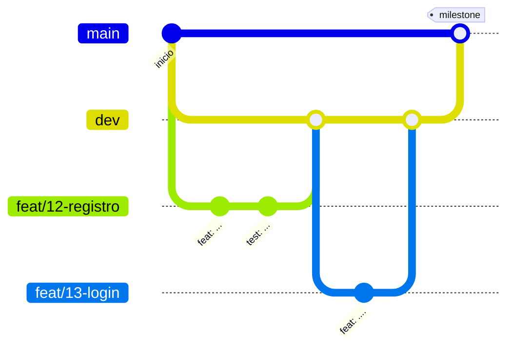

# Flujo de trabajo con Git

Cómo se trabaja en los tres repositorios de código (`app-kmp`, `catalogo-service` y `turnos-service`). El objetivo es que el historial muestre la evolución del trabajo y permita seguir cada cambio desde el requisito hasta el código (ENUNCIADO §13.1; [Constitución P-12](constitucion.md)).

## Quién hace qué

- **Las milestones y las issues las crea el alumno, desde la interfaz de GitHub.** Ningún agente las crea, las cierra ni las modifica por su cuenta.
- **Qué entra en cada milestone se conversa antes** entre el alumno y el agente: por dónde encarar el trabajo y cómo partirlo en issues.
- El agente trabaja sobre una issue que ya existe, en su rama.

## Ramas



| Rama | Para qué | Vida |
| --- | --- | --- |
| `main` | Lo entregable: el estado al cierre de cada milestone. Protegida | Permanente |
| `dev` | Integración: acá se junta el trabajo de las issues | Permanente |
| Rama de feature | El trabajo de **una** issue | Se borra al mergear a `dev` |

## Reglas

1. **Toda unidad de trabajo tiene una issue**, dentro de una milestone.
2. **Una rama por issue**, creada desde `dev` actualizada.
3. **Cada rama se mergea a `dev` por pull request** y después se borra.
4. **Al completar una milestone, `dev` se mergea a `main` por pull request.** Nadie commitea directo a `main`.
5. **El merge conserva los commits** (merge commit, sin squash), para que el historial muestre cómo se construyó cada cambio.
6. **Las pruebas pasan en CI** antes de mergear: el workflow de cada repo es un check obligatorio ([ADR-0046](adr/0046-ci-con-github-actions.md)).

GitHub solo cierra una issue automáticamente (`Closes #N`) cuando el cambio llega a la rama por defecto, que es `main`. Como las ramas de feature se mergean a `dev`, la issue se cierra a mano al mergear su PR, o queda cerrada sola cuando la milestone llega a `main`.

**Excepción: el repo `docs`.** No tiene ramas protegidas y se commitea directo a `main`, con Conventional Commits. Es documentación de trabajo propia y no forma parte de la entrega evaluada, así que no necesita el flujo de issues y PR.

## Milestones

Una milestone agrupa las issues que, juntas, dejan algo terminado y demostrable. Su alcance es chico: lo que entra en una sesión de trabajo, o poco más. Es una medida de alcance, no de tiempo: las milestones no tienen fecha.

## Relación con SDD

| SDD | Git |
| --- | --- |
| Tareas de una feature (`specs/NNN-nombre.md`) | Se commitea directo en `docs`. Es la base para conversar la milestone |
| Las tareas de ese archivo | El alumno las convierte en issues de una milestone, en el repo de código correspondiente |
| Cada issue | Una rama de feature y un PR hacia `dev` |
| Decisión nueva (ADR) | Se commitea directo en `docs`, antes de implementarla |

Si una tarea toca más de un repo (por ejemplo, un contrato entre servicios), se abre una issue en cada repo y se enlazan entre sí.

## Nombres

**Ramas:** `<tipo>/<número-de-issue>-<descripción-corta>`, en minúsculas y con guiones.

```
feat/12-registro-de-usuarios
fix/31-offset-kafka-tras-falla
docs/4-flujo-de-reserva
```

**Commits:** [Conventional Commits](https://www.conventionalcommits.org/). El tipo y los términos técnicos estándar van en inglés; el asunto, en español, breve y en imperativo. Cada commit tiene un solo cambio lógico.

```
feat(sync): agregar consumidor de CatalogUpdated
fix(auth): rechazar tokens vencidos en el catálogo
docs(adr): registrar decisión sobre zona horaria
```

Tipos: `feat`, `fix`, `docs`, `refactor`, `test`, `chore`, `build`, `ci`. El ámbito es opcional.

## Contenido de issues y PR

En español, explicativos y breves.

**Issue:** qué se necesita y por qué, con referencia a la HU, CU, ADR o spec correspondiente, y los criterios para darla por terminada.

**PR:**

- **Contexto:** qué problema resuelve. Enlaza la issue (`Closes #N`) y cita el requisito (HU, spec, ENUNCIADO o REF). El PR de una rama de feature apunta a `dev`.
- **Qué se hizo y por qué:** las decisiones tomadas y las alternativas descartadas, si no están ya en un ADR.
- **Cómo probarlo:** los tests que lo cubren y los pasos para verificarlo a mano, si hace falta.

## Secretos

Ningún commit, issue ni PR contiene el JWT técnico, credenciales, hosts de la cátedra ni valores de `integration` ([Constitución P-08](constitucion.md)). Si un secreto se commitea por error, borrarlo en un commit nuevo no alcanza, porque queda en el historial: hay que tratarlo como expuesto (REF §5.4).
